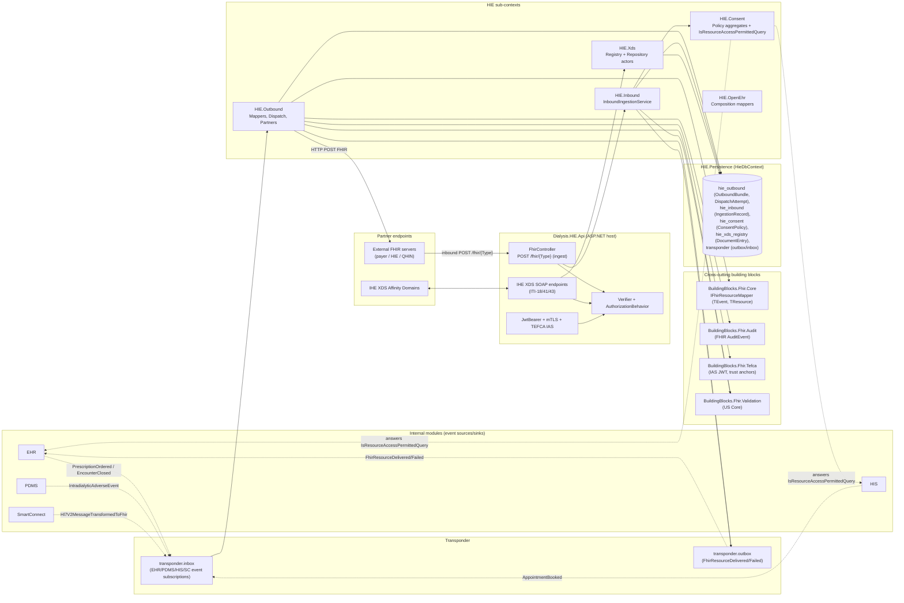
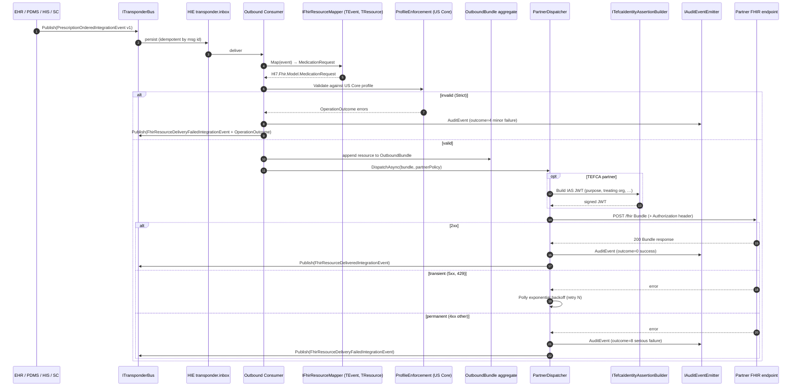
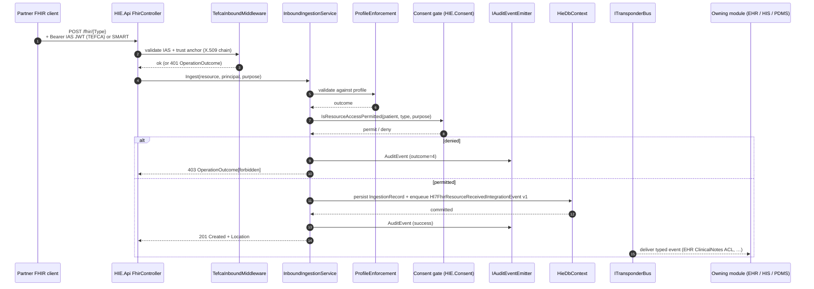
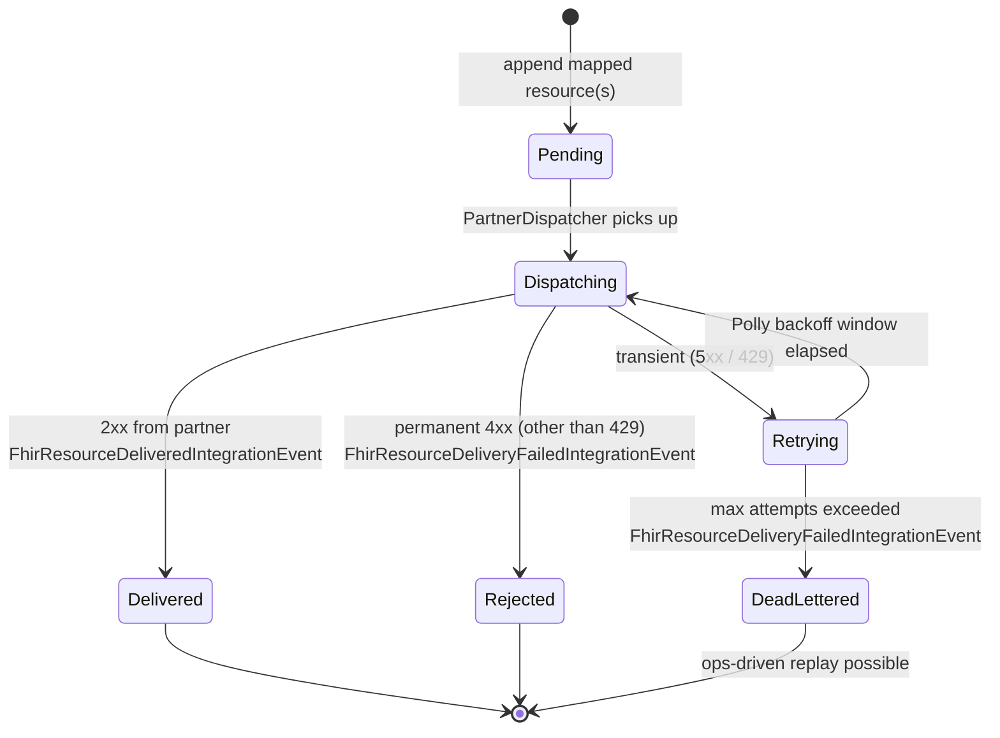
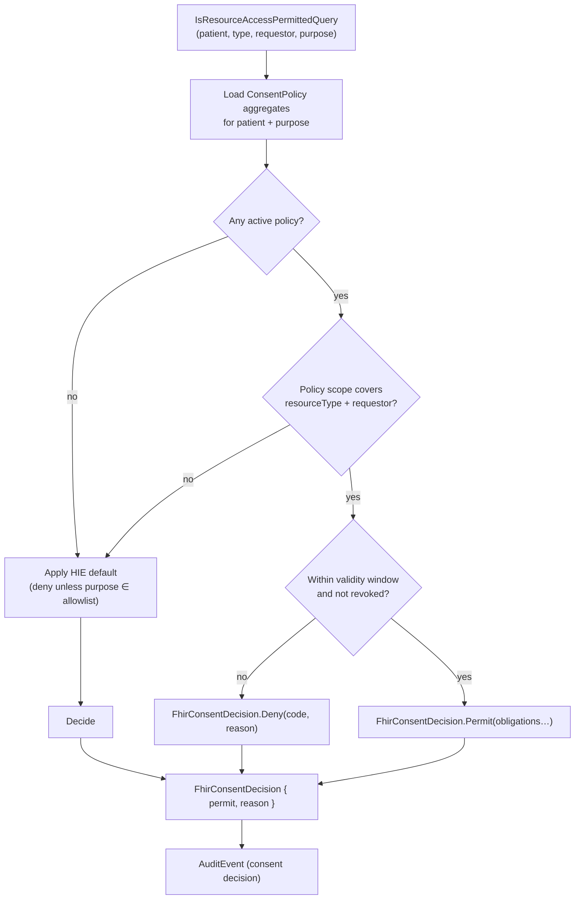
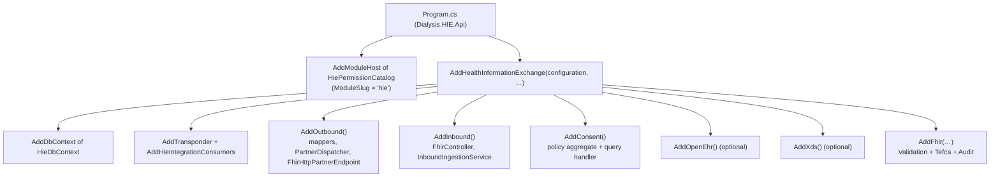
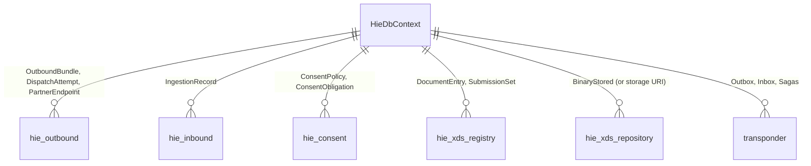

# HIE — Architecture (low-level)

The **Health Information Exchange** module is the platform's outward-facing FHIR / IHE gateway. It owns three responsibilities:

1. **Outbound dispatch** — translate internal integration events into FHIR R4 resources and POST them to partner endpoints with retry, signing, and audit.
2. **Inbound ingestion** — accept FHIR pushes from partners, validate, and route to the owning module via integration events.
3. **Consent gating** — be the source of truth for cross-organization release-of-information decisions; other modules query HIE via `IsResourceAccessPermittedQuery` for the cross-cutting FHIR read facade.

Sub-modules: `Outbound`, `Inbound`, `Consent`, `OpenEhr`, `Xds` (IHE XDS Registry+Repository actors).

> Mermaid renders inline on GitHub/GitLab/JetBrains/VS Code; paste into <https://mermaid.live> if your viewer does not.

---

## 1. System architecture (component view)

**Invariants**

- `Dialysis.HIE.Outbound` is the only place that POSTs FHIR to partner endpoints — other modules never speak HTTP-FHIR directly.
- Mappers implement `IFhirResourceMapper<TEvent, TResource>` from `BuildingBlocks.Fhir.Core`; they are protocol-pure (no HTTP, no persistence).
- All partner traffic is recorded as a FHIR `AuditEvent` via `BuildingBlocks.Fhir.Audit` — pervasive, not opt-in.
- TEFCA partners get an IAS JWT in `Authorization: Bearer …` (or `X-User-Authorization-JWT` per QHIN profile, configurable) built by `ITefcaIdentityAssertionBuilder`.

---

## 2. Workflow — Outbound dispatch (event → FHIR Bundle → partner)

---

## 3. Workflow — Inbound ingestion (partner POST → routed to owning module)

---

## 4. Activity — OutboundBundle lifecycle

**Note**: every state transition writes a `DispatchAttempt` row (latency, status code, partner, correlation id) and emits a FHIR `AuditEvent` — these are the substrate for the platform observability dashboards.

---

## 5. Activity — Consent decision (cross-module query)

---

## 6. Composition root

---

## 7. Data layout

---

## 8. Cross-context contracts (DDD context map)

| Counterparty | Role | Vehicle |
|---|---|---|
| EHR / PDMS / HIS / SmartConnect | **Customer** of upstream modules' integration events; **Supplier** of `FhirResourceDelivered/Failed` and `Hl7FhirResourceReceived`. | `Dialysis.<Module>.Contracts` ↔ `Dialysis.HIE.Contracts` |
| External FHIR partners | **Open Host Service** (read-time + ingest); **Published Language** is FHIR R4 + US Core (CH Core planned). | HTTP FHIR + IHE XDS SOAP |
| TEFCA / QHIN partners | **Open Host Service** with IAS-assertion-validated identity. | TEFCA IAS JWT, mutual trust bundle |
| Identity | **Conformist**. | JWT + per-partner client credentials |

---

## 9. Where to look next

- Outbound mappers → `Dialysis.HIE.Outbound/Mappers/{Patient,Encounter,LabOrder,LabResult,AdverseEvent,DialysisSession,ClinicalNote}Mapper.cs`.
- Partner dispatch → `Dialysis.HIE.Outbound/Dispatch/` and `Dialysis.HIE.Outbound/Partners/Http/FhirHttpPartnerEndpoint.cs`.
- Inbound ingest → `Dialysis.HIE.Inbound/Ingestion/InboundIngestionService.cs` + `Controllers/FhirController.cs`.
- Consent → `Dialysis.HIE.Consent/` (aggregate + query handler).
- XDS actors → `Dialysis.HIE.Xds/` (Registry ITI-18/42, Repository ITI-41/43).
- openEHR bridge → `Dialysis.HIE.OpenEhr/` (archetype ↔ FHIR mappers).
