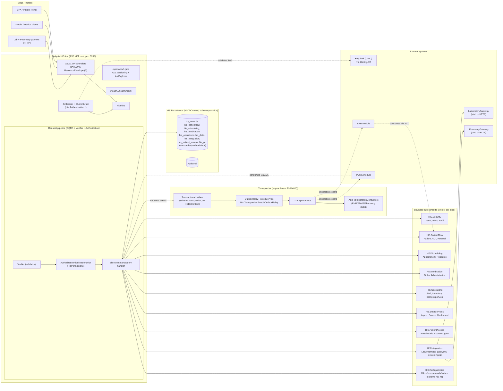
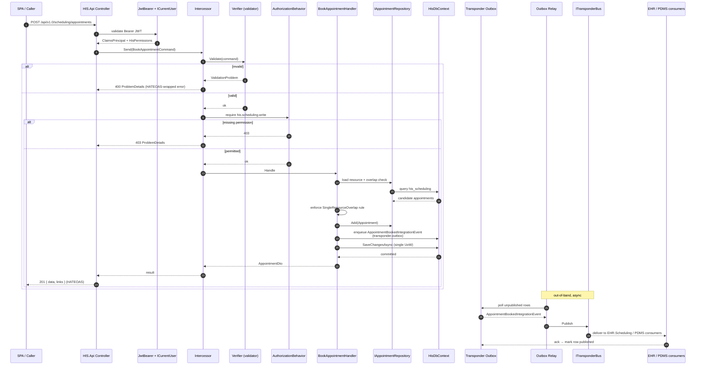
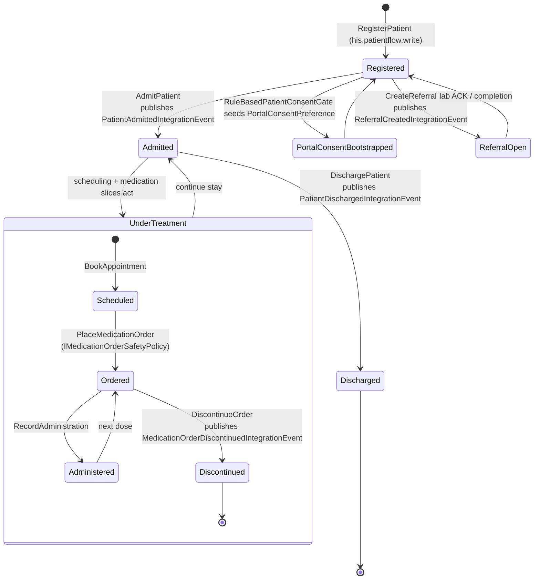
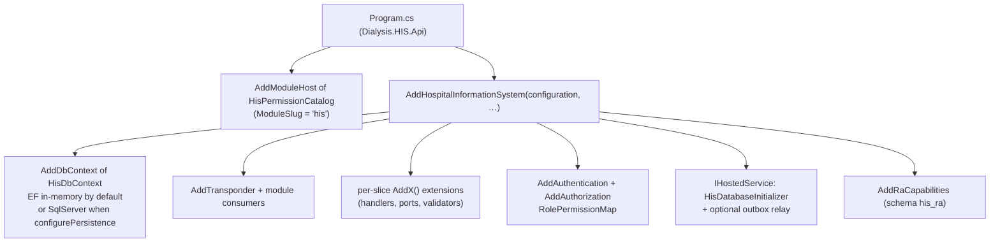
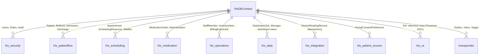

# HIS — Architecture (low-level)

Companion to [README.md](README.md) and [his_ddd_modular_plan.md](his_ddd_modular_plan.md). This file documents the **internal** anatomy of the Hospital Information System module: how the slices wire together, how a request flows through the host, and the state shape of the long-running aggregates.

> All diagrams are [Mermaid](https://mermaid.js.org/). GitHub, GitLab, JetBrains, and most modern Markdown previews render them inline; if a diagram does not render in your viewer, paste the fenced block into <https://mermaid.live>.

---

## 1. System architecture (component view)

The HIS host is a single ASP.NET process that composes one vertical slice per RA sub-context. Each slice owns its domain, its handlers, and its ports; persistence is unified in `HisDbContext` with **schema-per-context** table naming. Cross-slice references are forbidden — every cross-slice need traverses `Dialysis.HIS.Contracts`.

**Key invariants**

- The only assembly other modules may reference from HIS is `Dialysis.HIS.Contracts` — enforced by [ModuleBoundaryTests](../../tests/Dialysis.ArchitectureTests/ModuleBoundaryTests.cs).
- Cross-slice domain references are forbidden inside HIS — enforced by `BoundedContextReferenceTests`.
- Aggregate roots have **no public setters** — enforced by `AggregateRootEncapsulationTests`.
- Integration events all declare `int SchemaVersion` — enforced by event-versioning gate.

---

## 2. Workflow — Book Appointment (representative command path)

This is the canonical write workflow. It exercises auth, validation, aggregate invariants, outbox enqueue, and downstream event delivery.

**Why this shape**

- The outbox row and the aggregate change commit in the **same** EF transaction, so a successful 201 implies the event will eventually publish.
- The relay runs as an `IHostedService` only when `His:Transponder:EnableOutboxRelay = true` — dev hosts can drop the relay and still serve writes.
- Consumers across the bus boundary never load HIS aggregates; they apply ACL translators (see `Dialysis.HIS.Integration`).

---

## 3. Activity — Patient Flow lifecycle (Register → Admit → Discharge)

**Notes**

- `RegisterPatient` bootstraps a `PortalConsentPreference` row when `His:PatientAccess:RequireExplicitConsentRowForPortal` is true; otherwise the rule-based gate evaluates implicit consent.
- The medication sub-machine is guarded by `IMedicationOrderSafetyPolicy` (formulary check) at the `Ordered` transition.
- Every transition writes an `IAuditTrail` entry (separate `SaveChanges` per the README's compromise — promote to single UoW when warranted).

---

## 4. Composition root (how slices register)

**Configuration touch-points** are listed in [README.md §Configuration keys](README.md#composition-host-registration). The single rule: every flag is `His:*` scoped and bound by `IOptions<T>` inside the slice that owns it.

---

## 5. Data layout

Migrations history: `his_migrations` table (separate from `transponder.__ef_migrations`). The Transponder outbox/inbox lives on the **same** `DbContext` — there are no duplicate HIS-side outbox tables.

---

## 6. Where to look next

- Slice handlers → `Dialysis.HIS.<Slice>/Features/**`.
- Aggregate roots → `Dialysis.HIS.<Slice>/Domain/**` (no public setters; mutation via behaviour methods).
- Integration event contracts → `Dialysis.HIS.Contracts/IntegrationEvents/**`.
- RA capability traceability → [his_ra_submodules.md](his_ra_submodules.md).
- End-to-end outbox proof → [`.github/workflows/his-ci.yml`](../../../.github/workflows/his-ci.yml) + [his_transponder_e2e_runbook.md](his_transponder_e2e_runbook.md).
