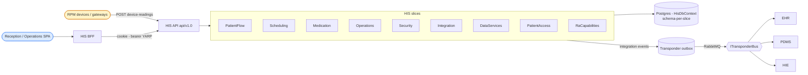
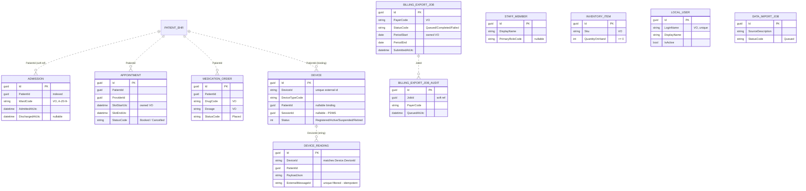
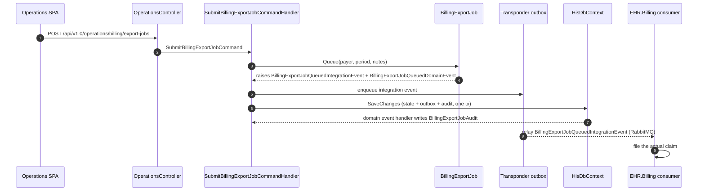

# HIS — Hospital Information System

> **Bounded context:** dialysis-centre **facility operations**. HIS runs the front desk and the operational spine of a clinic: admissions, the receptionist "today" queue, appointment booking, a thin medication-order surface, staff & inventory, RPM device registry + telemetry ingest, data import, local user accounts, and the Tummers et al. (2021) reference-architecture sub-capabilities.
>
> **What HIS does _not_ own:** the patient master record, the clinical chart, prescribing, lab/imaging orders and billing-claim filing — those belong to **[EHR](../EHR/ARCHITECTURE.md)**. HIS only *queues a billing-export request*; EHR files the claim. Cross-context coordination is exclusively via integration events (Transponder) — never a direct project reference.

This document is generated from the current code. See the root [README](../../../README.md) for the system-wide picture and [CLAUDE.md](../../../CLAUDE.md) for build/run conventions.

---

## 1. Context



HIS publishes operational facts (patient admitted, checked in, placed in chair, appointment booked, medication ordered, billing-export queued); EHR mirrors HIS-originated patients and files claims, PDMS reacts to chair placement.

---

## 2. Project layout

| Project | Role |
|---|---|
| `Dialysis.HIS.Contracts` | Integration events, `HisPermissions` catalog, `IPermissionedCommand`, outbox envelope. **The only assembly other modules may reference.** |
| `Dialysis.HIS.PatientFlow` | Admissions + receptionist "today" queue (`Admission`, `PatientQueueEntry`). |
| `Dialysis.HIS.Scheduling` | Appointment booking (`Appointment`). |
| `Dialysis.HIS.Medication` | Thin medication-order surface (`MedicationOrder`). |
| `Dialysis.HIS.Operations` | Staff, inventory, billing-export queue (`StaffMember`, `InventoryItem`, `BillingExportJob`, `BillingExportJobAudit`). |
| `Dialysis.HIS.Security` | HIS-local user accounts (`LocalUser`). |
| `Dialysis.HIS.Integration` | RPM device registry + device-reading ingest (`Device`, `DeviceReadingRecord`). |
| `Dialysis.HIS.DataServices` | Data-import jobs, patient search, manager dashboard, outbox-metadata read. |
| `Dialysis.HIS.PatientAccess` | Patient-portal summary read model (query-only). |
| `Dialysis.HIS.RaCapabilities` | Reference-architecture sub-capability rows (schema `his_ra`). |
| `Dialysis.HIS.Persistence` | Single `HisDbContext`, schema-per-slice config, EF repositories, read models, `HisPatientEraser`. |
| `Dialysis.HIS.Composition` | `AddHospitalInformationSystem(...)` registration. |
| `Dialysis.HIS.Api` | ASP.NET host: versioned MVC `api/v1.0/...`, HATEOAS envelope, durable-command bus, health probes. |
| `Dialysis.HIS.Bff` | Per-context BFF (OIDC cookie + YARP) with event-driven push. |
| `Dialysis.HIS.Tests` | xUnit + `WebApplicationFactory`. |

Slices follow Evans' **Responsibility Layers**; each owns its commands/queries/handlers/aggregates and a Postgres schema (`his_patientflow`, `his_scheduling`, `his_medication`, `his_operations`, `his_security`, `his_integration`, `his_data`, `his_ra`).

---

## 3. Domain model (ERD)

Every aggregate root derives `AggregateRoot<Guid>` → `Audit`, so each row carries `CreatedAt/By`, `UpdatedAt/By`, `IsDeleted/DeletedAt/By` (soft-delete). **There are no database foreign keys between aggregates** — cross-entity links are bare `Guid` references (the model is a set of independent aggregate tables); `Patient` lives in EHR. The `PatientQueueEntry` is intentionally **in-memory** (`InMemoryPatientQueueRepository`, demo-seeded), not an EF table.



**Additional schemas on the same `HisDbContext`:** `his_ra` (13 reference-architecture projection tables — waitlist, patient-alerts, CDS evaluations, medication-dispensing, specialist encounters, etc.; `RaWaitlistEntry.Notes` is PHI, encrypted at rest), `his_durablecommands.command_ledger` (durable-command idempotency/status, keyed on `CommandId`), and `transponder` (outbox/inbox/saga). Provider: stock PostgreSQL (`postgres:17-alpine`); migrations history `his.__ef_migrations`.

---

## 4. Integration events

**Published** (each raised by an aggregate, copied to the Transponder outbox in the same transaction, relayed when the outbox relay is enabled):

| Event | Trigger |
|---|---|
| `PatientAdmittedIntegrationEvent` | `Admission.Admit` — patient admitted to a ward |
| `PatientDischargedIntegrationEvent` | `Admission.Discharge` |
| `PatientCheckedInIntegrationEvent` | `PatientQueueEntry.CheckIn` — expected arrival → Waiting |
| `PatientPlacedInChairIntegrationEvent` | `PatientQueueEntry.AssignChair` — Waiting → InTreatment (PDMS reacts) |
| `WalkInRegisteredIntegrationEvent` | `PatientQueueEntry.WalkIn` |
| `AppointmentBookedIntegrationEvent` | `Appointment.Book` |
| `MedicationOrderPlacedIntegrationEvent` | `MedicationOrder.Place` |
| `BillingExportJobQueuedIntegrationEvent` | `BillingExportJob.Queue` — consumed by `Dialysis.EHR.Billing` to file the claim |

**Consumed:** HIS takes no external events into its own domain. Its only consumers fan out *its own* `PatientAdmittedIntegrationEvent` — `PatientAdmittedSubscriptionBroadcaster` (maps to a FHIR `Encounter`, broadcasts to FHIR Subscriptions) and the BFF's `PatientAdmittedNotificationConsumer` (SignalR toast). One **in-process domain event**, `BillingExportJobQueuedDomainEvent`, writes the `BillingExportJobAudit` row inside the same `SaveChanges`.

---

## 5. Key workflows

### 5.1 Device-reading durable ingest

`IngestDeviceReading` opts into the durable command bus (flag `His:DurableCommands:IngestDeviceReading:Enabled`). When on, the API returns `202 Accepted` with a status-poll URL the moment the command is in a publisher-confirmed RabbitMQ queue; a consumer applies it idempotently. When off, it dispatches synchronously and returns `201`.

```mermaid
sequenceDiagram
    autonumber
    participant Dev as Device / gateway
    participant Api as DeviceIntegrationController
    participant Bus as IDurableCommandBus - RabbitMQ
    participant Con as DurableCommandConsumer&lt;HisDbContext&gt;
    participant H as IngestDeviceReadingCommandHandler
    participant DB as HisDbContext

    Dev->>Api: POST /api/v1.0/integration/device-readings (X-Command-Id?)
    Note over Api: ReadingId = X-Command-Id ?? new Guid
    alt durable flag ON
        Api->>Bus: EnqueueAsync(cmd, commandId = ReadingId)
        Bus-->>Api: publisher confirm
        Api-->>Dev: 202 Accepted + Location: command-status/{id}
        Bus->>Con: deliver envelope
        Con->>DB: BEGIN tx, claim command_ledger row (idempotent)
        Con->>H: dispatch command
        H->>H: rate-limit, registry governance, idempotency check
        H->>DB: add DeviceReadingRecord
        Con->>DB: mark ledger Applied, COMMIT
    else durable flag OFF
        Api->>H: SendCommandAsync (synchronous)
        H->>DB: add DeviceReadingRecord, SaveChanges
        Api-->>Dev: 201 Created
    end
    Dev->>Api: GET /api/v1.0/command-status/{correlationId}
    Api-->>Dev: { Status: Applied, readingId } (403 if sub != requester)
```

Registry governance rejects readings from unknown devices (when registration is required), from `Suspended`/`Retired` devices, or on a patient-binding mismatch; domain rejections throw `DomainException` → mapped to `4xx`, never `500`.

### 5.2 Billing-export queue — integration event + in-process audit



---

## 6. API surface

All controllers extend `HisHateoasControllerBase` and return the `ResourceEnvelope<T>` `{data, links}` HATEOAS envelope. Health: `/health/live`, `/health/ready`.

| Route group | Highlights |
|---|---|
| `patient-flow` | admissions, discharge, today's-queue, check-in, assign-chair, walk-in |
| `scheduling` | book appointment |
| `medication` | place order |
| `operations` | staff role, inventory movements, billing export-jobs (queue + read) |
| `security` | register local user |
| `data-management` | import-jobs, integration outbox-metadata, patient search, manager-dashboard |
| `patient-access` | `patients/{id}/portal-summary` (patient-claim filtered) |
| `integration` | `device-readings` (durable `IngestDeviceReading`), `devices` registry (register/bind/status/list) |
| `reference-architecture` | `catalog`, `capabilities/*` (RA sub-capabilities), `help` |

Permissions are the closed `HisPermissions` set (20 strings, e.g. `his.operations.staff.assign`, `his.integration.device.ingest`, `his.patientflow.admit`), exposed generically via `HisPermissionCatalog`. See [Identity](../Identity/ARCHITECTURE.md) for how permission claims reach the API.

---

## 7. Compliance

`HisPatientEraser : IPatientEraser` implements GDPR Art. 17: it **soft-deletes** the Audit-tracked aggregates (`Appointment`, `Admission`, `MedicationOrder` via `ExecuteUpdateAsync`) and **hard-deletes** the plain telemetry/RA rows (`DeviceReadingRecord`, `RaPatientAlert`, `RaWaitlistEntry`, `RaSpecialistEncounterRecord`, `RaEhrDocumentExchangeRecord`, `RaClinicalDecisionSupportEvaluation` via `ExecuteDeleteAsync`), returning per-type counts. The Art. 17 pipeline is orchestrated centrally — see [HIE](../HIE/ARCHITECTURE.md) for the approve-and-execute flow and the `IErasureRequestStore`.
