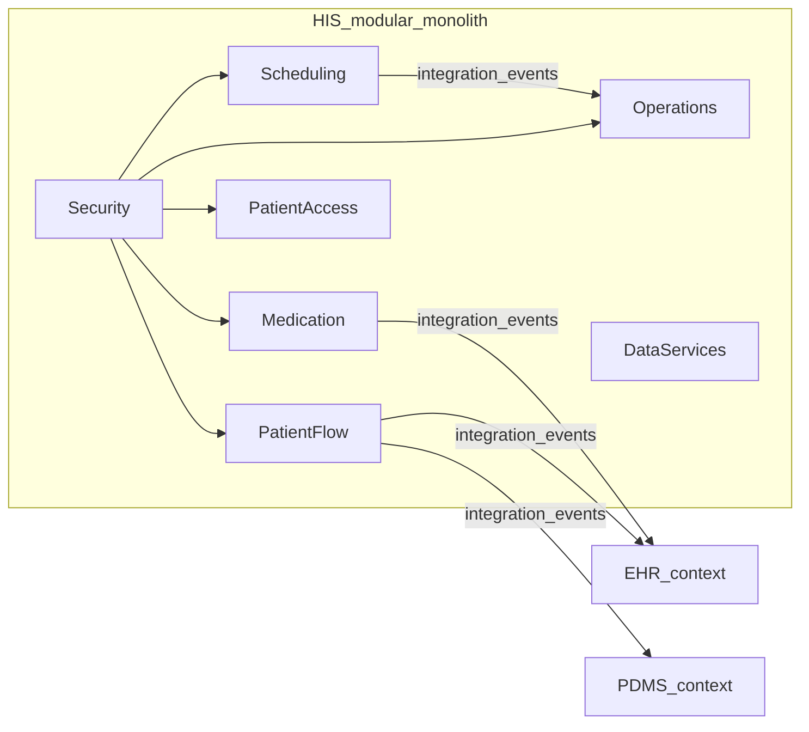

# HIS implementation plan (RA-aligned, modular monolith, DDD + vertical slices)

_Archived from the Cursor plan `his_ddd_modular_plan_89c0e0a4` for in-repo reference. Paths below are relative to the repository root unless noted._

**Implementation status** for the HIS codebase is maintained in the living checklist in [README.md](./README.md) (build, host, tests, Transponder consumers). The phased checklist below stays aligned with the RA paper; **[x]** means a first vertical slice or stub exists in `src/backend/HIS`, not that production hardening is finished.

**Fig. 6 (34 sub-modules)** — exact box labels and per-row **Stub / Partial / Production-ready** mapping: [his_ra_submodules.md](./his_ra_submodules.md). Production security and integration roadmaps: [his_production_security_backlog.md](./his_production_security_backlog.md), [his_integration_backlog.md](./his_integration_backlog.md).

## Source of truth from the book

The PDF ([`docs/book/s12911-021-01570-2.pdf`](../../../docs/book/s12911-021-01570-2.pdf)) is **Tummers et al., BMC Med Inform Decis Mak (2021)** — “Designing a reference architecture for health information systems” ([DOI](https://doi.org/10.1186/s12911-021-01570-2)). Use it as the **feature and module taxonomy**, not as a prescription for a specific tech stack:

- **Stakeholders and concerns**: Table 1 (administrative staff, care professional, patient, government, insurance, laboratory, pharmacist, other HIS, etc.).
- **Domain feature model**: six top-level feature groups — **Generic MIS**, **Data management**, **Medication management**, **Patient monitoring**, **Planning & scheduling**, **Security** (plus optional/sub-domain features as in Fig. 4 in the paper).
- **Decomposition view (RA)**: **six modules, 34 sub-modules** (Fig. 6): *Medication management*, *Patient monitoring* (includes ADT-like concerns, status, referrals, EHR input, patient portal), *Security* (authentication, authorization, security mechanisms), *Planning and scheduling*, *Generic MIS* (assets/staff/inventory, org communication, quality, financial / ERP-like), *Data management* (import, sharing, analysis, search).
- **Layered view** (Fig. 7): presentation → **business** (planning, generic MIS, patient monitoring, medication) → **data management** → **vertical security** cutting all layers.
- **Deployment view** (Fig. 8): generic client/server/cloud patterns for later ops; **not** required for first code slices.

Codebase alignment with DDD + messaging + CQRS:

- Aggregates can raise in-process domain events and cross-boundary integration events via [`AggregateRoot<TId>`](../DomainDrivenDesign/Dialysis.Domain.Driven.Design.Core.Abstraction/Primitives/AggregateRoot.cs).
- Commands/queries dispatch through [`CqrsGateway`](../CQRS/Dialysis.CQRS.Core/CqrsGateway.cs) / [`CqrsBuilder`](../CQRS/Dialysis.CQRS.Core/CqrsBuilder.cs) on top of **Intercessor** + **Verifier**.
- **Transponder** ([`ITransponderBus`](../BuildingBlocks/Transponder/Transponder.Abstractions/ITransponderBus.cs)) is the hook for **async integration** between slices/contexts (and eventually external systems). See [Transponder README](../BuildingBlocks/Transponder/README.md).

[`src/backend/HIS`](.) — modular monolith assemblies; compose from a host via [`Dialysis.HIS.Composition`](./Dialysis.HIS.Composition/HospitalInformationSystemExtensions.cs) alongside existing modules (e.g. [`EHR`](../EHR), [`PDMS`](../PDMS)) when you add an application host.

---

## Bounded contexts (DDD) mapped from the RA

Treat each **RA decomposition module** as one **bounded context** in code, with a **context map** documented in-repo (this README + plan). Names map to .NET root namespaces under `Dialysis.HIS.*`.

| RA module (paper)     | Bounded context (code)                                                                                                                             | Core responsibility                                                                                                                | Integrates with (typical)                                                     |
| --------------------- | -------------------------------------------------------------------------------------------------------------------------------------------------- | ---------------------------------------------------------------------------------------------------------------------------------- | ----------------------------------------------------------------------------- |
| Security              | `Dialysis.HIS.Security`                                                                                                                            | Identity, sessions, RBAC/ABAC policy points, crypto/config for “security mechanisms”, audit hooks                                  | All other contexts (policy enforcement at app boundary + domain where needed) |
| Planning & scheduling | `Dialysis.HIS.Scheduling`                                                                                                                          | Appointments, calendars, resource/room assignment, waitlists                                                                       | Patient flow, clinical services                                               |
| Patient monitoring    | Split: **`Dialysis.HIS.PatientFlow`** (ADT, referrals, status) and **`Dialysis.HIS.PatientAccess`** (portal-facing read models + limited commands) | ADT + care pathway state vs patient-facing channel                                                                                 | EHR/PDMS as downstream or peer via integration events                         |
| Medication management | `Dialysis.HIS.Medication`                                                                                                                          | Medication orders, administration documentation, safety rules (as domain policies)                                                 | Pharmacy systems (external), clinical data                                    |
| Generic MIS           | `Dialysis.HIS.Operations`                                                                                                                          | Staff/assets/inventory, internal comms, quality workflows, financial/billing **stubs** aligned to insurance/reimbursement concerns | Scheduling, patient flow                                                      |
| Data management       | `Dialysis.HIS.DataServices`                                                                                                                        | Import/export pipelines, structured search, analytics **interfaces**; keep **read models per slice** where possible                | All producers/consumers of integration events                                 |

**Relationship to existing repos**: [`EHR`](../EHR) and [`PDMS`](../PDMS) are separate bounded contexts. Do not let HIS domain models reference their internals directly; use **anti-corruption layers**, **integration events** (`IIntegrationEvent` + outbox + Transponder), and a minimal **shared kernel** only where justified.

---

## Physical structure (modular monolith + strict vertical slices)

Under `src/backend/HIS`, **one assembly per bounded context**, **vertical slices** inside each assembly:

- `Features/<FeatureName>/` — command/query, handler, validator, slice-local types
- `Domain/` — entities/value objects shared within the context
- `Infrastructure/` — optional; today many ports are implemented in `Dialysis.HIS.Persistence`

**Rules (SOLID + VSA)**:

- Co-locate what a feature needs; avoid a catch-all `Services` folder.
- **Dependencies point inward**; no HIS context A → context B **domain** references; use contracts and integration events.
- **CQRS**: [`ICommand`](../CQRS/Dialysis.CQRS.Core.Abstraction/Commands/ICommand.cs) / [`IQuery`](../CQRS/Dialysis.CQRS.Core.Abstraction/Queries/IQuery.cs) + handlers; register via `CqrsBuilder.AddFromAssembliesOf` in composition.
- **Verifier**: `AbstractValidator<T>` per message at the slice boundary.
- **Transponder**: publish integration events after commit (outbox today); see [Transponder README](../BuildingBlocks/Transponder/README.md).

---

## Feature checklist (RA-aligned, phased)

Use as **implementation backlog**; order reflects stakeholder risk. See [README.md](./README.md) for commands and project map.

### Phase A — Platform and composition

- [x] **A1**: HIS projects under `src/backend/HIS` (one per bounded context + `Dialysis.HIS.Contracts` + persistence + composition), listed in repo root **`Dialysis.slnx`**.
- [x] **A2**: Composition root + **`Dialysis.HIS.Api`** (ASP.NET Core MVC controllers, API versioning `v{version}` + **OpenAPI per version** via `Microsoft.AspNetCore.OpenApi` + `Asp.Versioning.Mvc.ApiExplorer`; successful JSON uses **HATEOAS** `data` + `links`; RA extended reads live under **`Dialysis.HIS.RaCapabilities`** + **`GET .../reference-architecture/capabilities`**).
- [x] **A3**: Persistence strategy (one database, schema per context) + **EF migrations** (`HisDbContextDesignTimeFactory` resolves SQL the same way as the API host: appsettings + env, optional `-- --connection`; includes scheduling resources / portal consent / device idempotency migration after initial).
- [x] **A4**: **Transponder** transactional outbox/inbox on `HisDbContext`; outbox relay + broker for production per Transponder README.

### Phase B — Security (RA: Security)

- [x] **B1**: Local user model (stub; replace with real IdP when ready).
- [x] **B2**: Role/permission model; authorization pipeline on permissioned commands/queries.
- [ ] **B3**: Security mechanisms (secrets, transport, password policies) — beyond stub.
- [x] **B4**: Audit trail port + EF implementation (refine single-UoW with domain if needed).

### Phase C — Patient monitoring / flow

- [x] **C1**: Patient / MRN on aggregate (EHR link when EHR is source of truth — ACL pattern in integration stubs).
- [x] **C2**: ADT commands (register, admit, discharge) and read models where listed in README.
- [x] **C3**: Referral create (narrow type); expand referral taxonomy as needed.
- [x] **C4**: Integration events + Transponder outbox; **EHR/PDMS `IConsumer<>`** stubs in `Dialysis.HIS.Integration`.

### Phase D — Planning & scheduling

- [x] **D1**: Appointment model + book command + overlap rule in handler.
- [x] **D2**: **`SchedulingResource`** + directory / kind-aware booking + list query (demo seed); deeper calendars / waitlists still open.
- [x] **D3**: Verifier + handler rules on book interval, patient/resource resolution, and bookable kind match.

### Phase E — Medication management

- [x] **E1**: Orders (place + **discontinue** with domain invariants) + integration events.
- [x] **E2**: Administration documentation command.
- [x] **E3**: **`IMedicationOrderSafetyPolicy`** at place-order; pharmacy **Transponder consumers** + `IPharmacyGateway` stub; real pharmacy + full formulary still open.

### Phase F — Generic MIS

- [x] **F1**–**F3**: Staff/inventory/billing **stubs** (README); deepen for hospital scenario as needed.

### Phase G — Data management

- [x] **G1**–**G3**: Import/search/dashboard **stubs** (README); real pipelines still open.

### Phase H — Integration

- [x] **H1**: `IntegrationEventCatalog` + contract events (add **version suffixes** to names when you break payloads).
- [x] **H2**: Laboratory **gateway stub** + referral **consumer** (ACL-shaped path); other gateway stubs as in README; broker-backed transports still open.
- [x] **H3**: Device ingest + **rate limiter** + optional **external message id** for idempotent ingest; scale-out hardening still open.

### Phase I — Patient portal

- [x] **I1** / **I2**: Portal summary + appointment request + **rule-based** consent (`PortalConsentPreference`, bootstrap on patient register); production consent + patient-scoped auth still open.

---

## Definition of done (per vertical slice)

- Command/query + handler + validator + persistence (if any) live in the **same feature folder**.
- Domain invariants in aggregates where state transitions exist; **Verifier** at the edge.
- **No cross-context domain references**; only contracts/events.
- Tests: handler + domain unit tests for non-trivial rules — see **`Dialysis.HIS.Tests`** (expand per slice).

---

## Notes on strictness

- **Vertical Slice Architecture** = feature folders, not duplicated layer cake per feature.
- **SOLID**: small handlers, explicit policy types.
- **Modular monolith**: enforce with project references; optional architecture tests later.
