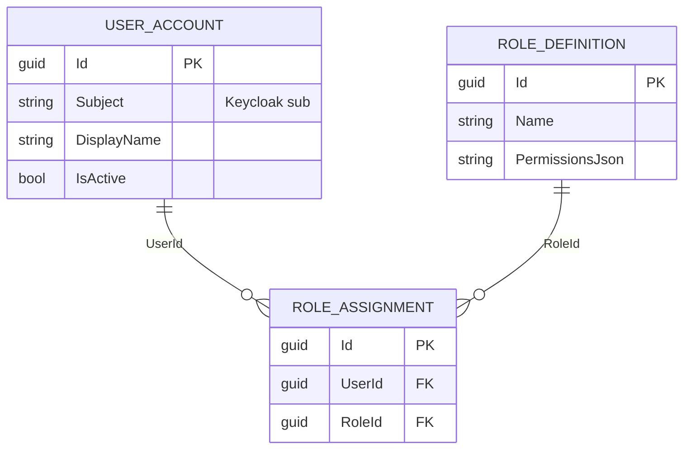
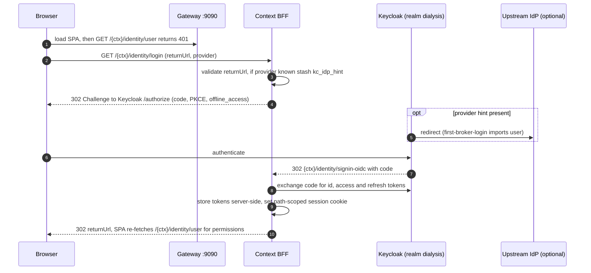
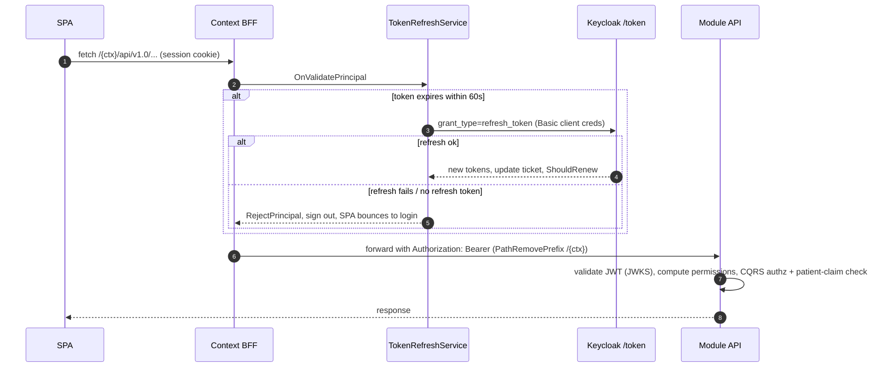

# Identity & Auth

> **Bounded context + cross-cutting layer.** The Identity module provisions user accounts, roles and role assignments. The surrounding **auth layer** — the edge Gateway, the per-context BFFs, and Keycloak — is what every other module relies on for sign-in, session continuity, and permission claims.
>
> **Topology:** a single browser origin (the **Gateway**, `:9090`) fronts one **BFF per bounded context** (his, ehr, pdms, smartconnect, hie, admin, portal), each running its own OIDC + path-scoped cookie session against the shared **Keycloak** realm `dialysis`. Modules validate JWTs only when an Authority is configured; in dev with no Authority, all permissions are granted for local work.

Generated from current code. See the root [README](../../../README.md) for the system picture.

> **Note on prior docs:** earlier documentation described a single Identity BFF at `:5275` proxying to HIS and one unified SPA. The current model is **per-context BFFs** (`dialysis-<ctx>-bff` Keycloak clients, ports 5301–5307) behind the Gateway; the standalone `Dialysis.Identity.Bff` (`:5275`, legacy `dialysis-bff` client) still exists as the global `/identity/*` login path.

---

## 1. Project layout

| Project | Role |
|---|---|
| `Dialysis.Identity.Api` | Provisioning host: `POST /api/v1/users`, `/{id}/deactivate`, `GET /{id}/permissions`, role CRUD/assign. |
| `Dialysis.Identity.Contracts` | `UserRegistered/Deactivated`, `RoleAssigned/Revoked` events + `IdentityPermissions`. |
| `Dialysis.Identity.Provisioning` | Slices: ProvisionUser, DeactivateUser, DefineRole, Assign/RevokeRole. Aggregates `UserAccount`, `RoleDefinition`, `RoleAssignment`. |
| `Dialysis.Identity.Persistence` | `IdentityDbContext` (schema `identity`) + Transponder outbox. |
| `Dialysis.Identity.Bff` | **Legacy** global login BFF (`:5275`), mounted at the Gateway's `/identity/*`. |
| `Dialysis.Admin.Bff` | Per-context BFF for the `/admin` workspace (shared building block). |
| `keycloak/dialysis-realm.json` | Realm import (clients, roles, mappers, federation placeholders). |
| **Shared building blocks** (`src/backend/Shared/`) | |
| `Dialysis.Module.Bff` | `AddModuleBff()` / `MapModuleBff()` — the canonical per-context BFF. |
| `Dialysis.Module.Bff.Events` | `AddModuleBffEvents()` — consume-only Transponder subscription + SignalR `NotificationsHub`. |
| `Dialysis.Module.Gateway` | YARP edge gateway (`:9090`). |
| `Dialysis.Module.Hosting` | Module host scaffolding incl. JWT auth + `ICurrentUser`. |

Provisioning aggregates:

---

## 2. Keycloak realm

Realm `dialysis` (access-token lifespan 300 s, SSO idle 1800 s). Clients:

- **`dialysis-<ctx>-bff`** (his/ehr/pdms/smartconnect/hie/admin/portal) — confidential BFF clients, standard flow + token-exchange, redirect URIs scoped to `http://localhost:9090/<ctx>/*`.
- **`dialysis-his-api`** — resource-server audience for module JWT validation.
- **`smart-on-fhir`** — public PKCE client with SMART scopes.
- **`dialysis-data-simulator`** — client-credentials service account driving dev writes through BFFs.
- **`dialysis-bff`** — legacy confidential BFF (redirect URIs include both `:5275` and `:9090`).

**Protocol mappers** on every BFF client: `roles` (realm-role mapper, multivalued), and **`dialysis_permission`** — a JSON-typed claim emitted to access + userinfo tokens carrying the permission strings the SPA's `PermissionGate` checks. In dev this is a hardcoded "grant everything" mapper; production replaces it with a real per-user mapper. The `dialysis-portal-bff` client additionally maps `his_patient_id` for patient-self row scoping.

**Multi-IdP federation** is brokered through Keycloak, not the BFF: `identityProviders[]` holds disabled placeholders for `okta`, `auth0`, `entra`. The BFF forwards `kc_idp_hint=<alias>` when a caller hits `/<ctx>/identity/login?provider=<alias>`, gated by an `IIdentityProviderCatalog` allowlist.

---

## 3. BFF & gateway mechanics

`AddModuleBff()` wires a cookie scheme (default) + OIDC challenge:

- A **server-side ticket store** (`DistributedCacheTicketStore`, Valkey-backed) keeps the token bundle off the browser — only a session key lives in the cookie, avoiding HTTP 431 from per-context cookie pile-up on the shared origin. Valkey also backs the Data Protection key ring for multi-replica cookie decryption.
- The cookie is **path-scoped** to `/<ctx>` (`SameSite=Lax`), so contexts don't collide on `:9090`.
- OIDC requests `openid profile email offline_access` (the `offline_access` scope forces Keycloak to issue a refresh token).
- A **YARP module proxy** forwards `{base}/api/*` and `{base}/hubs/*` to the module API, attaching `Authorization: Bearer <access_token>` from the cookie ticket; `{base}/api/_x/{key}/...` aggregations reach sibling contexts.

The **Gateway** is the only browser origin. Routes (all anonymous at the edge — auth is enforced downstream): `/identity/*` → legacy Identity BFF; `/auth/*` → Keycloak; per context `/<ctx>/identity`, `/<ctx>/api`, `/<ctx>/hubs`, `/<ctx>/events` → that context's BFF; `/<ctx>/*` → that context's SPA. The root `/` serves a static launchpad chooser.

---

## 4. Auth model across modules

`AddModuleHost<TPermissionCatalog>` registers JWT Bearer **only when `{ModuleSlug}:Authentication:Authority` is set** (and fails startup outside Development if it's missing). With an Authority, a module computes `ICurrentUser.Permissions` as the union of `dialysis_permission` claim values and `RolePermissionMap[roles]`, both filtered against the module's closed `IModulePermissionCatalog`. Patient-facing routes additionally check the `his_patient_id` (fallback `sub`) claim against the route's `patientId`. In dev with no Authority, `ICurrentUser` exposes the entire catalog.

---

## 5. Key workflows

### 5.1 Browser login (optional upstream IdP)

### 5.2 Authenticated API call & silent refresh

---

## 6. Event-driven BFF

`AddModuleBffEvents()` layers real-time push on a BFF: a consume-only Transponder/RabbitMQ subscription (queue `bff-<slug>`, **no DbContext, no outbox**) and a `[Authorize]` SignalR `NotificationsHub` at `/<ctx>/events`. A consumer maps an integration event to a PHI-light `BffNotification` and pushes it via `IBffNotifier` to the `patient:{id}` or `user:{sub}` group; the SPA toasts it and **refetches through the synchronous, permission-checked API**. Reads stay synchronous — this is push-only signalling, not a BFF read model. Wired in the EHR, PDMS, HIS and patient-portal BFFs today.
