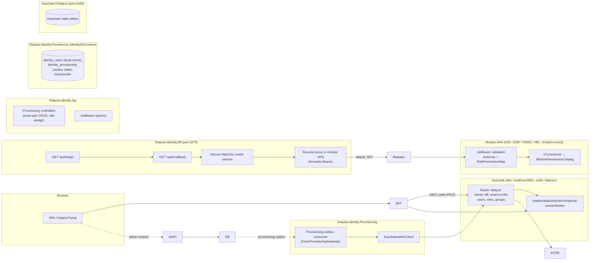
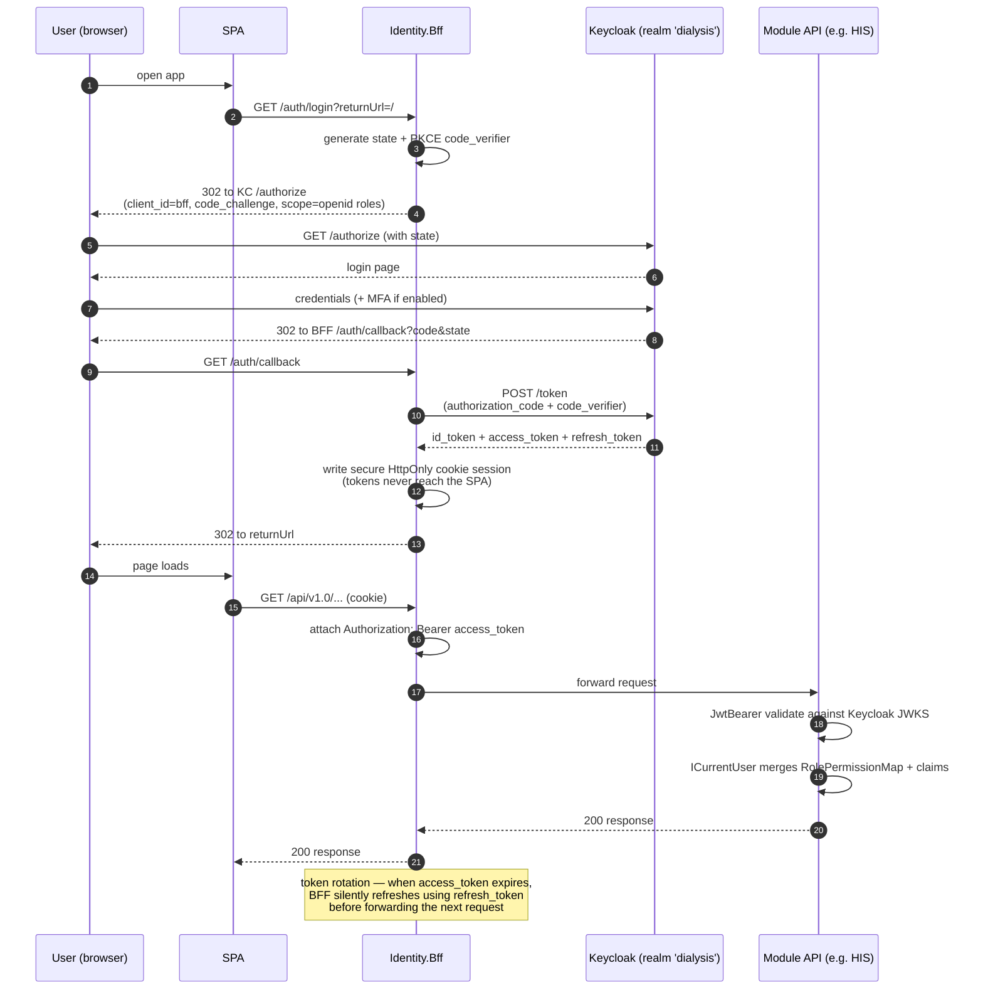
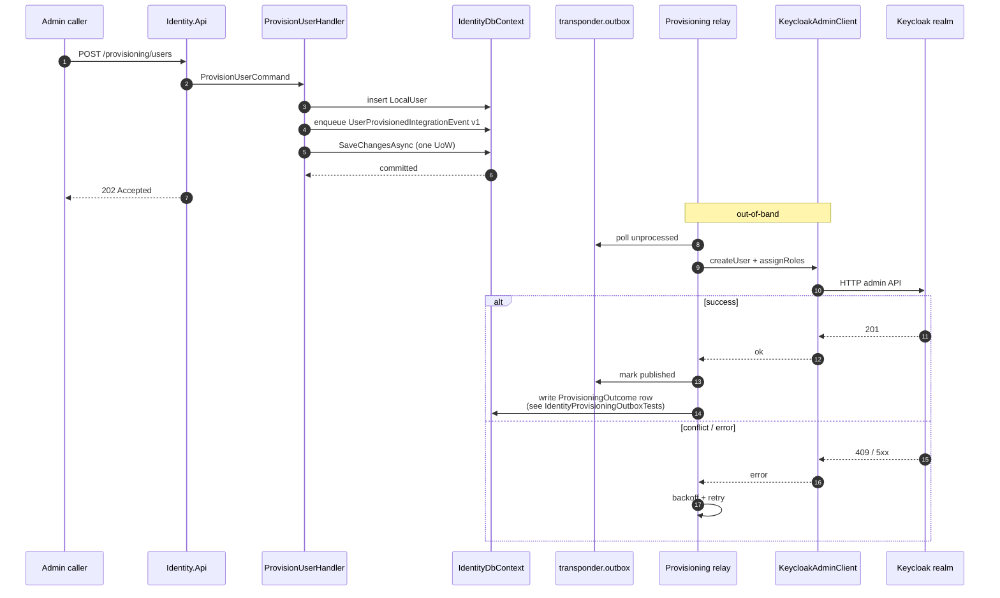
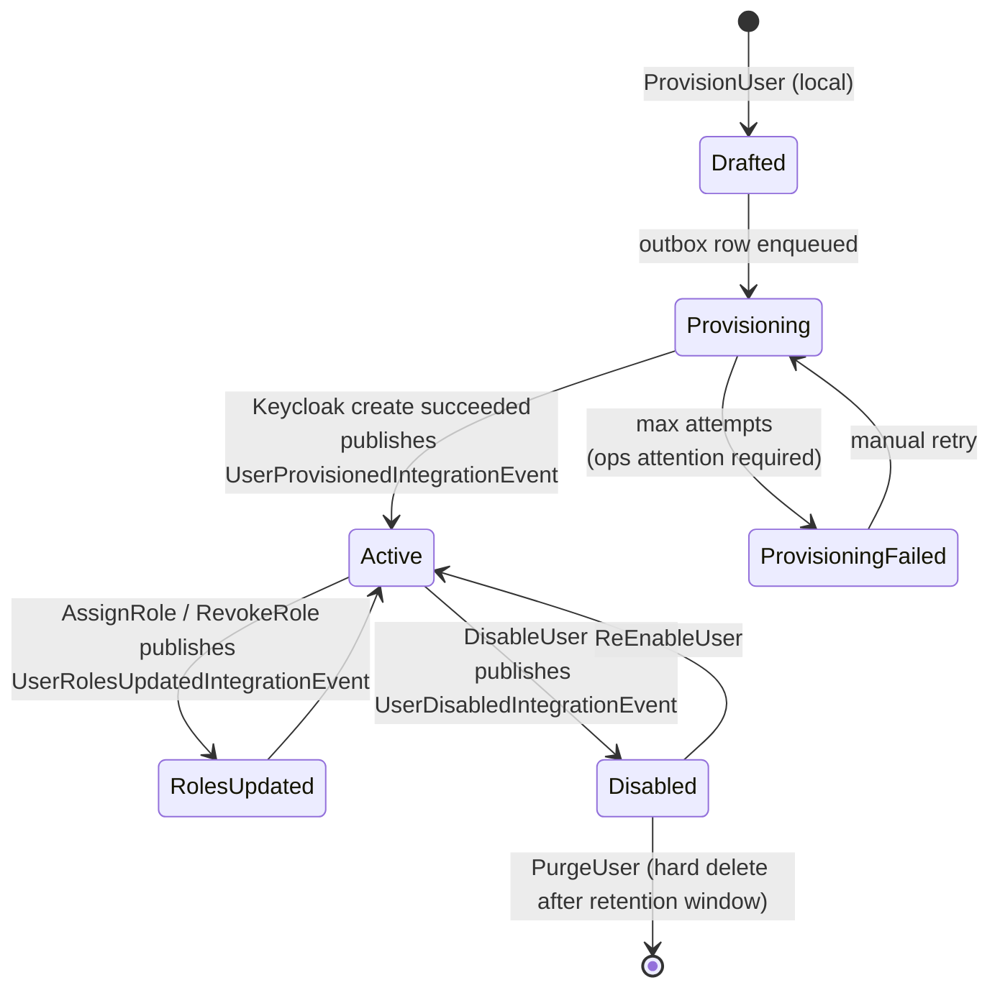
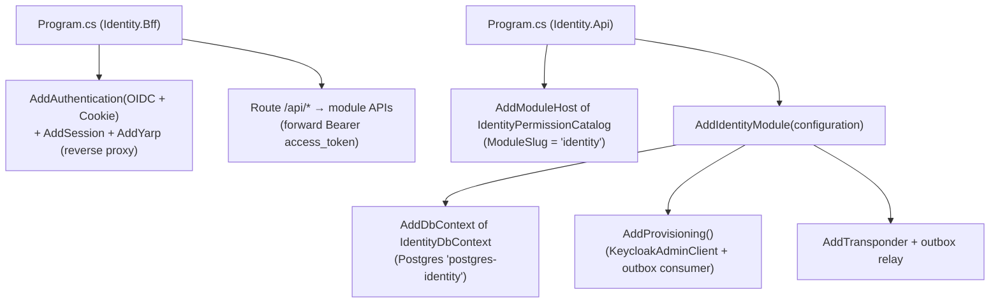
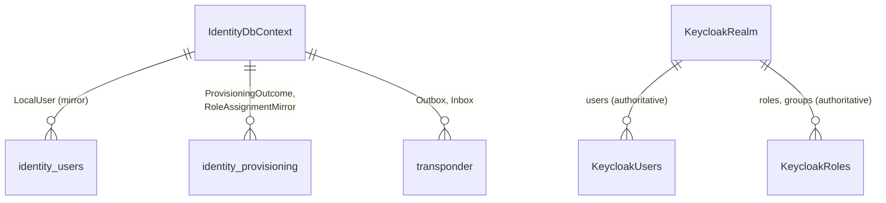

# Identity — Architecture (low-level)

Companion to [README.md](README.md), [RUNBOOK.md](RUNBOOK.md), and [identity_subdomain_structure.md](identity_subdomain_structure.md). Identity is a **Generic Subdomain** (Evans 2003, p. 281) — the platform deliberately keeps it thin. The module stands on a standard OIDC broker (Keycloak in dev) and exposes:

- `Dialysis.Identity.Bff` — browser entry, OIDC code-flow + secure cookie session, JWT proxy to module APIs.
- `Dialysis.Identity.Api` — local user provisioning + role assignment.
- `Dialysis.Identity.Provisioning` — outbox-driven sync to Keycloak.
- `Dialysis.Identity.Contracts` — integration events + claim shape contract.

The whole module is intentionally **replaceable**: any IdP that issues the same claim shape is a drop-in.

> Mermaid renders inline on GitHub/GitLab/JetBrains/VS Code; paste into <https://mermaid.live> if your viewer does not.

---

## 1. System architecture (component view)

**Claim contract (published language)**

Every module-side JWT is expected to carry the following claims; this is the **invariant** that any IdP swap must preserve:

| Claim | Meaning |
|---|---|
| `sub` | Stable subject id (NameIdentifier). |
| `email` / `email_verified` | Optional. |
| `roles` (or `groups`) | IdP role/group names — mapped per-module via `<Module>:Authentication:RolePermissionMap` to `IModulePermissionCatalog` permission strings. |
| `his_patient_id` | Optional. Used by HIS PatientAccess to scope portal endpoints. `sub` is accepted as a fallback when it equals route `patientId`. |
| `patient`, `encounter`, `fhirUser` | SMART-on-FHIR launch context (when issued via the `smart-on-fhir` Keycloak client). |
| `his_permission` / module-equivalent | Optional explicit permission claim (merged with `RolePermissionMap` output). Claim type is configurable per module. |

---

## 2. Workflow — Browser login via BFF (OIDC code + PKCE)

---

## 3. Workflow — Provisioning outbox sync

The Provisioning slice writes local user mutations to its DbContext and to the Transponder outbox in **one** transaction. A background outbox relay then drives Keycloak admin calls — the local store is the source of truth for what was *requested*; Keycloak is the source of truth for what was *applied*.

Tests for the outbox path live in [Dialysis.Identity.Tests/IdentityProvisioningOutboxTests.cs](Dialysis.Identity.Tests/IdentityProvisioningOutboxTests.cs).

---

## 4. Activity — User lifecycle

---

## 5. Composition root

**Configuration keys (BFF)**

- `Authentication:Oidc:Authority` — Keycloak realm URL.
- `Authentication:Oidc:ClientId` / `ClientSecret` — confidential client `bff`.
- `Authentication:Oidc:Scope` — space-delimited (`openid profile email roles offline_access`).
- `Cookie:Name` / `Cookie:Domain` / `Cookie:SecurePolicy` — session cookie attributes.
- `ReverseProxy:Routes:*` — YARP route map to module APIs.

---

## 6. Data layout

---

## 7. Cross-context contracts

| Counterparty | Role | Vehicle |
|---|---|---|
| HIS / EHR / PDMS / HIE / SmartConnect | **Supplier** of identity claims (Conformist on the consumer side). | OIDC JWT; module-side `RolePermissionMap` |
| Keycloak | **Vendor** — opaque external IdP. | OIDC discovery + Admin REST |
| FHIR SMART-on-FHIR clients | **Customer**: launch + standalone flows authorized via `smart-on-fhir` Keycloak client. | OIDC + PKCE, launch-context claims |

---

## 8. Operational notes

- The Keycloak realm `dialysis` is **auto-imported from [keycloak/dialysis-realm.json](keycloak/dialysis-realm.json)** on container start. Update that JSON to add clients / roles; commit alongside code changes.
- The Identity docker-compose lives at [docker-compose.yml](docker-compose.yml) (Keycloak + Postgres on port 5444); the root `docker-compose.modules.yml` runs the broader containerized stack, and the Aspire AppHost (`dotnet run --project src/aspire/Dialysis.AppHost`) is the local dev entrypoint.
- BFF + JWT smoke test → [RUNBOOK.md](RUNBOOK.md).

---

## 9. Where to look next

- BFF host → `Dialysis.Identity.Bff/Program.cs` and `appsettings.json`.
- Provisioning slice → `Dialysis.Identity.Provisioning/` and `IdentityProvisioningOutboxTests`.
- Realm definition → [keycloak/dialysis-realm.json](keycloak/dialysis-realm.json).
- Long-form rationale → [identity_subdomain_structure.md](identity_subdomain_structure.md).
