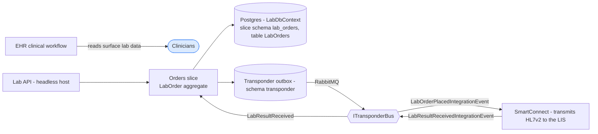
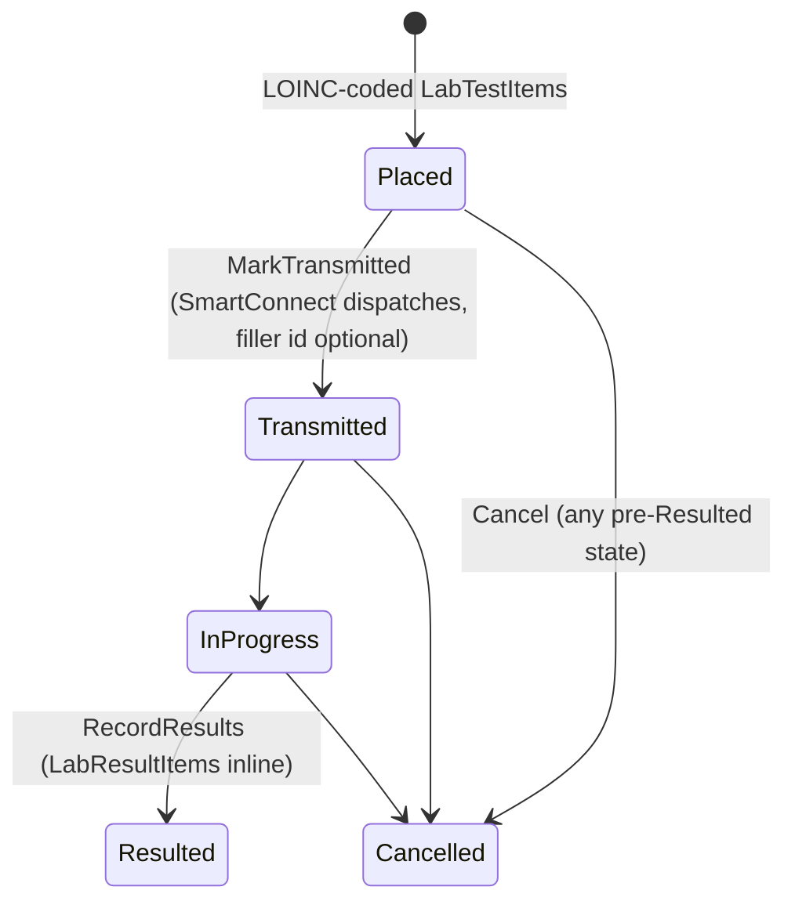

# Lab — Laboratory Orders

> **Bounded context:** the **order desk to the LIS**. Lab owns the lifecycle of a laboratory
> order — placed by a clinician, transmitted to the laboratory information system, resulted back
> as LOINC-coded observations — and nothing else. It is deliberately **headless**: there is a
> `Dialysis.Lab.Api` host, but no BFF and no web app; clinicians read lab data through the EHR
> clinical workflow, and the module talks to the world purely via integration events.

Generated from current code. See the root [README](../../README.md) for the system picture.

## Context

Order lifecycle (state machine on the `LabOrder` aggregate):

## Slices

- **Orders** (the only slice): `LabOrder` aggregate with the state machine
  `Placed → Transmitted → InProgress → Resulted`. Requested tests are LOINC-coded
  (`LabTestItem`) and ride inline on the order row, as do the resulted observations
  (`LabResultItem`).
  - `PlacerOrderNumber` is the stable order identity used to match returned results:
    `LAB-` + the order id's 48-bit timestamp prefix + its 64-bit random tail (32 chars,
    unique-indexed — `UX_LabOrders_PlacerOrderNumber`).

## Integration (events only — no synchronous callers)

| Direction | Event | Peer |
|---|---|---|
| publishes | `LabOrderPlacedIntegrationEvent` | SmartConnect transmits the order to the LIS (HL7v2) |
| consumes | `LabResultReceivedIntegrationEvent` | SmartConnect ingests LIS results; Lab records observations and marks the order `Resulted` |

Unknown placer order numbers on inbound results are logged and ignored (the result belongs to a
different system or a purged order).

## Persistence

`LabDbContext` (module schema `lab`); the `LabOrders` table lives in the slice schema
`lab_orders`, with the Transponder outbox/inbox/saga tables under `transponder` on the same
context (module rule: one DbContext, one outbox). Composition root:
`AddLaboratory()` in `Dialysis.Lab.Composition`.

## Compliance

- **Art. 17 erasure**: `LabPatientEraser` soft-deletes the patient's orders via
  `ExecuteUpdateAsync` (tests/results ride inline, so they are erased with the row).
- **Art. 15/20 export**: `LabModuleDataExtractor` mirrors the eraser's scope, emitting the
  shared camelCase JSON bundle.

## Tests

`Dialysis.Lab.Tests` — domain unit tests plus Testcontainers-backed eraser/extractor suites via
`LabApiWebApplicationFactory` (real Postgres, fresh database per fixture).
