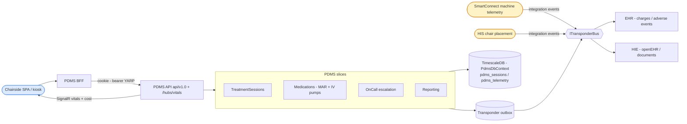
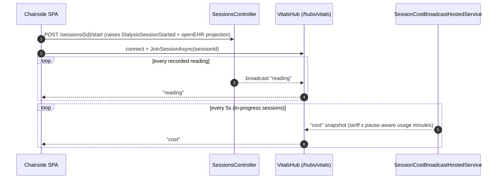
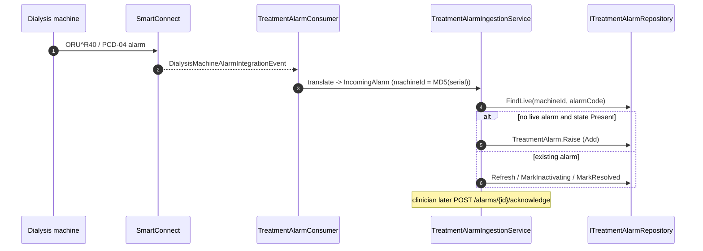

# PDMS — Patient Data Management System

> **Bounded context:** the **machine room**. PDMS watches each dialysis treatment in real time — it records the prescription, binds the machine, streams intradialytic vitals and machine telemetry, raises and tracks treatment alarms, captures the medication administration record, drives IV-pump infusions, escalates alarms to on-call staff, and renders the post-session clinical documents.
>
> **System metaphor** (Evans 2003): *a `DialysisSession` is a treatment-machine cycle observed through telemetry.* PDMS began as a single slice; it has since grown sibling business slices — **TreatmentSessions** (core), **Medications** (MAR + IV pumps), **OnCall** (alarm escalation), **Reporting** (session documents) — all persisting through one `PdmsDbContext`.

Generated from current code. See the root [README](../../../README.md) for the system picture.

---

## 1. Context



---

## 2. Project layout

| Project | Role |
|---|---|
| `Dialysis.PDMS.Contracts` | Session/billing/openEHR integration events, `PdmsPermissions`, openEHR archetype ids. **Only assembly other modules reference.** |
| `Dialysis.PDMS.Core[.Abstraction]` | `IPdmsClock`, `IPdmsUnitOfWork`, module constants. |
| `Dialysis.PDMS.TreatmentSessions` | **Core slice.** `DialysisSession`, `TreatmentAlarm`, `DialysisMachine`, `TreatmentObservation`, `IntradialyticReading`, ACL translators (SmartConnect), projections, FHIR feeder. |
| `Dialysis.PDMS.Medications` | MAR (`MedicationAdministrationRecord`), `IvPumpInfusion`, `MedicationInventoryItem`, vendor IV-pump drivers (Alaris/Baxter/Hospira). |
| `Dialysis.PDMS.OnCall` | `OnCallRotation`, `EscalationPolicy`, `AlarmDispatch` — alarm paging/escalation. |
| `Dialysis.PDMS.Reporting` | `SessionReport`, `ReportTemplate` — discharge letter / shift report / billing document generation. |
| `Dialysis.PDMS.Persistence` | Single `PdmsDbContext`, EF configs, repositories, migrations (incl. the Timescale hypertable), `PdmsPatientEraser`. |
| `Dialysis.PDMS.Core.Persistence.{Abstractions,InMemory,Postgresql}` | Generic repository provider split (chosen via `Pdms:Persistence:Provider`). |
| `Dialysis.PDMS.Composition` | `AddPatientDataManagementSystem(...)`. |
| `Dialysis.PDMS.Api` | ASP.NET host: 7 controllers, `VitalsHub`, cost-broadcast hosted service, durable-command bus. |
| `Dialysis.PDMS.Bff` | Per-context BFF with chairside event push. |
| `Dialysis.PDMS.Tests` | xUnit across all slices. |

---

## 3. Domain model (ERD)

`DialysisSession` is the aggregate root; `IntradialyticReading` is its only EF child (real FK, cascade). Everything else is **session-keyed by a soft `SessionId`** (no enforced constraint). Session, MAR and SessionReport carry a **direct `PatientId`**. Telemetry entities live in schema `pdms_telemetry`; sessions and readings in `pdms_sessions`.

```mermaid
erDiagram
    PATIENT ||..o{ DIALYSIS_SESSION : "PatientId"
    DIALYSIS_SESSION ||--o{ INTRADIALYTIC_READING : "FK cascade (hypertable)"
    DIALYSIS_SESSION ||..o{ TREATMENT_OBSERVATION : "SessionId"
    DIALYSIS_SESSION ||..o{ TREATMENT_ALARM : "SessionId (nullable)"
    DIALYSIS_MACHINE ||..o{ DIALYSIS_SESSION : "MachineId"
    DIALYSIS_SESSION ||..o{ MAR : "SessionId"
    MAR ||--o{ MAR_ENTRY : "owned"
    DIALYSIS_SESSION ||..o{ IV_PUMP_INFUSION : "SessionId"
    DIALYSIS_SESSION ||..o{ SESSION_REPORT : "SessionId"

    DIALYSIS_SESSION {
        guid Id PK
        guid PatientId "indexed"
        datetime ScheduledStartUtc
        datetime ActualStartUtc "nullable"
        datetime ActualEndUtc "nullable"
        int Status "Scheduled/InProgress/Completed/Aborted/Cancelled/Paused"
        guid MachineId "nullable"
        decimal AchievedUfVolumeLiters
        json Prescription "owned VO"
        json Access "owned VO - vascular access"
    }
    INTRADIALYTIC_READING {
        guid Id PK "ValueGeneratedNever"
        guid SessionId FK
        datetime ObservedAtUtc "hypertable partition"
        int SystolicBloodPressure
        int DiastolicBloodPressure
        int HeartRateBpm
        decimal VenousPressureMmHg
        decimal UltrafiltrationRateMlPerHour
    }
    TREATMENT_ALARM {
        guid Id PK
        guid SessionId "nullable"
        guid MachineId "MD5 of serial"
        long AlarmCode
        int State "Present/Inactivating/Resolved"
        datetime AcknowledgedUtc "nullable"
    }
    TREATMENT_OBSERVATION {
        guid Id PK
        guid SessionId
        guid MachineId
        long MdcCode "ISO/IEEE 11073"
        decimal ValueNumeric
        string Units "UCUM"
    }
    DIALYSIS_MACHINE {
        guid Id PK
        string SerialNumber "unique"
        string VendorCode
        string ModelCode
        guid CurrentSessionId "nullable"
    }
    MAR {
        guid Id PK
        guid SessionId
        guid PatientId
        int Status "Open/Closed"
    }
    MAR_ENTRY {
        guid Id PK
        json Medication "owned VO"
        bool WasAdministered
        string DeclineReason "nullable"
    }
    IV_PUMP_INFUSION {
        guid Id PK
        guid SessionId
        guid ChairId
        decimal InfusedVolumeMl
        int Status "Running/Paused/Completed/Alarm"
    }
    SESSION_REPORT {
        guid Id PK
        guid SessionId
        guid PatientId
        int Kind "DischargeLetter/ShiftReport/BillingDocument"
        int Status "Pending/Generated/Delivered/Archived/Failed"
        string StorageRef "blob"
    }
```



The **OnCall** slice adds `OnCallRotation`, `EscalationPolicy`, and `AlarmDispatch` (with owned `Attempts`); the durable-command ledger lives in `pdms_durablecommands.command_ledger`. `RawHl7Message` and `MdcCodeCatalogEntry` round out the telemetry schema.

### 3.1 TimescaleDB hypertable

`pdms_sessions.IntradialyticReadings` is a **TimescaleDB hypertable** partitioned by `ObservedAtUtc` (1-day chunks), `compress_segmentby = SessionId` with a **7-day compression policy** and a **365-day retention policy**. The PK is rewritten to the composite `(Id, ObservedAtUtc)` because Timescale requires the partition column in any unique index; the EF model key stays `Id`. PDMS therefore runs the `timescale/timescaledb:latest-pg17` image (every other module uses stock `postgres:17-alpine`). Startup uses `MigrateAsync` (not `EnsureCreated`) because the migration runs `create_hypertable`.

---

## 4. Durable command bus — `RecordReading`

The highest-volume write (intradialytic readings) opts into the durable command bus (flag `Pdms:DurableCommands:RecordReading:Enabled`, default off). The reading id is derived from the command id, so a 202 caller knows the new row's id without polling and a redelivery is idempotent.

```mermaid
sequenceDiagram
    autonumber
    participant Src as Device / chairside SPA
    participant Api as SessionsController
    participant Bus as IDurableCommandBus - RabbitMQ
    participant Con as DurableCommandConsumer&lt;PdmsDbContext&gt;
    participant Led as command_ledger
    participant H as RecordReadingCommandHandler
    participant VB as IVitalsBroadcaster

    Src->>Api: POST /sessions/{id}/readings (X-Command-Id)
    alt flag ON
        Api->>Bus: EnqueueAsync(cmd, commandId = readingId)
        Bus-->>Api: publisher confirm
        Api-->>Src: 202 + Location command-status/{correlationId}
        Bus->>Con: deliver envelope
        Con->>Led: BEGIN tx, TryClaim (idempotent on CommandId)
        Con->>H: dispatch
        H->>H: session.RecordReading(explicitReadingId = CommandId)
        H->>VB: broadcast "reading" to session:{id}
        Con->>Led: MarkApplied, COMMIT
    else flag OFF
        Api->>H: SendCommandAsync (synchronous)
        Api-->>Src: 201 Created
    end
    Src->>Api: GET /api/v1.0/command-status/{correlationId}
    Api-->>Src: { Status: Applied, readingId } (403 if sub != requester)
```

The bus emits a `Dialysis.DurableCommandBus` meter (`commands_enqueued/applied/failed` + latency histograms).

---

## 5. Key workflows

### 5.1 Chairside vitals & live cost

A clinician opens a session, joins the SignalR `VitalsHub` group `session:{id}`, and receives each recorded reading plus an itemised cost snapshot every **5 seconds** (`SessionCostBroadcastHostedService`). Valkey backs the SignalR backplane so multiple replicas fan out consistently.



### 5.2 Machine alarm ingest (resolve-or-raise)



---

## 6. API surface

`sessions` (schedule/start/pause/resume/complete/abort, readings, adverse-events, summaries — `GET` uses `?activeOnly`), `alarms` (active board, acknowledge, raise machine alarm), `chairs` (occupancy board), `sessions/{id}/medications` (MAR), `iv-pumps` (telemetry, infusions), `inventory`, `oncall` (rotations/policies/dispatches), `reports`/templates. Realtime: `VitalsHub` at `/hubs/vitals` emitting `"reading"` and `"cost"`. Permissions: the closed `PdmsPermissions` set.

---

## 7. Integration events & compliance

**Published:** `DialysisSessionStarted/Completed/Aborted`, `IntradialyticAdverseEvent`, `DialysisSessionChargeReady` (→ EHR billing), `HaemodialysisSessionProjectedAsOpenEhr` (→ HIE), `ClinicalDocumentProduced` (→ HIE Documents), plus slice events (`MedicationAdministered/Declined`, `IvPumpInfusionStarted/Completed`, `IvPumpAlarmRaised`, `MedicationInventoryLow`, `SessionReportGenerated`).

**Consumed:** `DialysisMachineTreatmentSnapshot` / `DialysisMachineAlarm` (SmartConnect telemetry), `PatientPlacedInChair` (HIS → chair-occupancy projection), and several self-consumed events that drive reporting, inventory deduction, and on-call escalation.

`PdmsPatientEraser : IPatientEraser` (GDPR Art. 17) projects the patient's session ids first, soft-deletes the session-keyed children (`IntradialyticReading`, `TreatmentObservation`, `TreatmentAlarm`, `IvPumpInfusion`, `AlarmDispatch`) and the sessions, then the direct patient-linked rows (`MedicationAdministrationRecord`, `SessionReport`) — all via `ExecuteUpdateAsync`. Bounded retention of telemetry is handled by the Timescale retention policy; the approve-and-execute orchestration lives in [HIE](../HIE/ARCHITECTURE.md).
