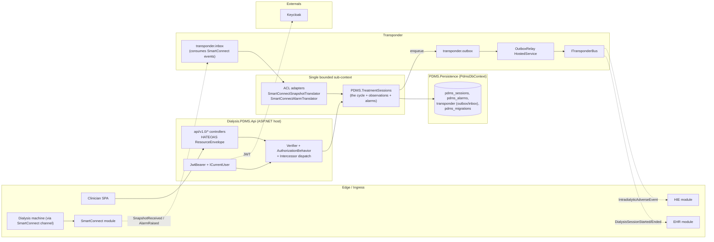
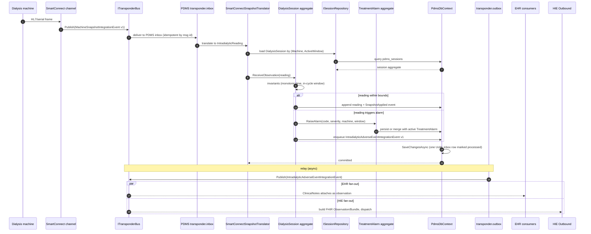
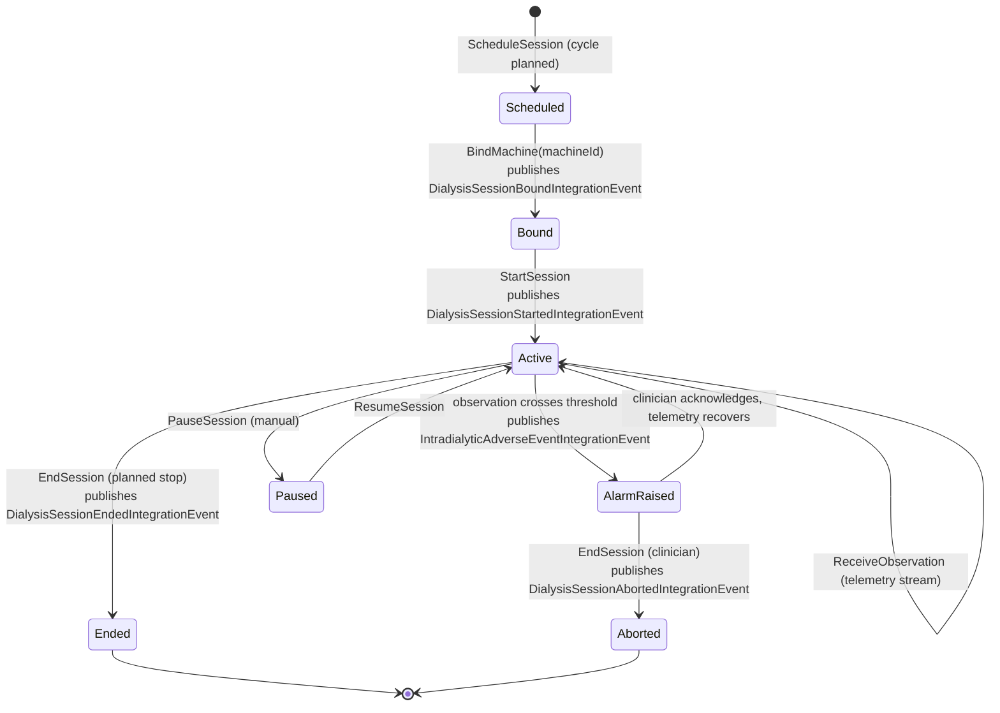
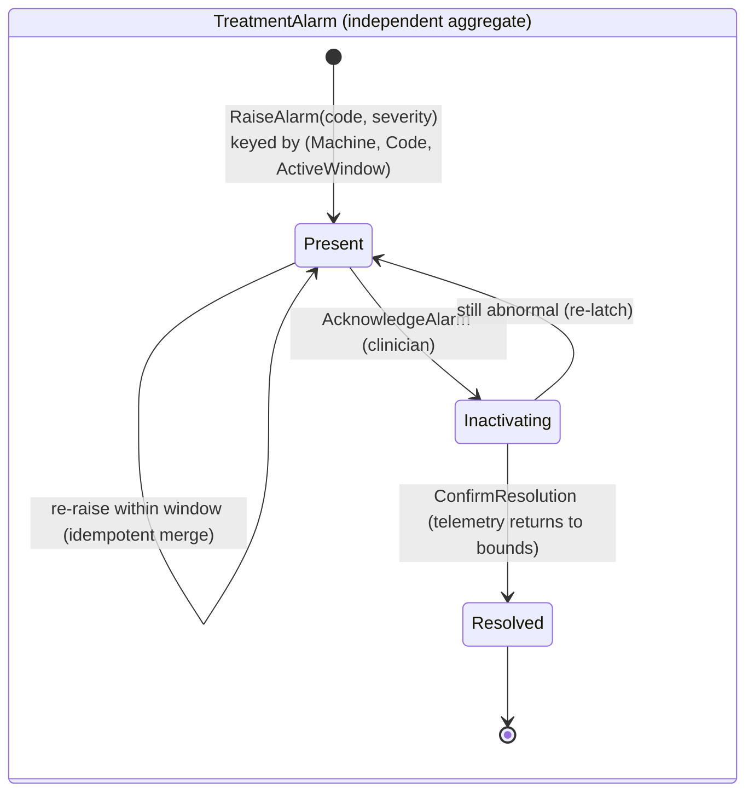
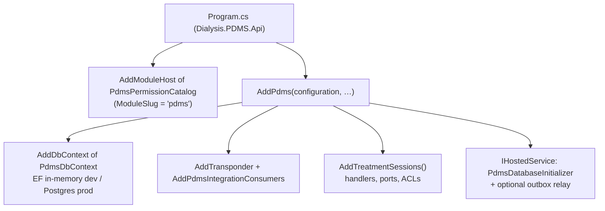
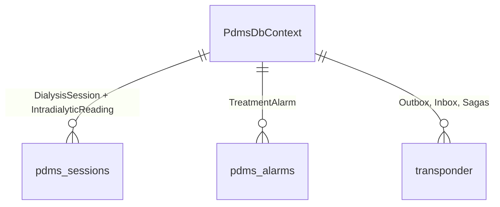

# PDMS — Architecture (low-level)

Companion to [README.md](README.md) and [pdms_subdomain_structure.md](pdms_subdomain_structure.md). PDMS is the **Patient Data Management System** that captures the dialysis machine cycle as it happens. Its Large-Scale Structure is the **System Metaphor** (Evans 2003, p. 313): *a `DialysisSession` is a treatment machine cycle observed through telemetry*. Two aggregate roots only — `DialysisSession` (with `IntradialyticReading` children) and `TreatmentAlarm` (independent).

> Mermaid renders inline on GitHub/GitLab/JetBrains/VS Code; paste into <https://mermaid.live> if your viewer does not.

---

## 1. System architecture (component view)

**Invariants**

- The metaphor stops at the PDMS edge — the **ACL translators** (`SmartConnectSnapshotTranslator`, `SmartConnectAlarmTranslator`) are the only path by which external telemetry enters the cycle.
- `DialysisSession` and `TreatmentAlarm` have **no public setters** — every change goes through behaviour methods (`BindMachine`, `ReceiveObservation`, `RaiseAlarm`, `EndSession`).
- A `TreatmentAlarm` is keyed by `(Machine, AlarmCode, ActiveWindow)` — two raises of the same code on the same machine within the same active window de-duplicate to one aggregate.

---

## 2. Workflow — Telemetry → Session observation → Adverse event

This is the canonical inbound workflow: a SmartConnect channel publishes a normalized telemetry message; PDMS consumes it via the inbox, the ACL translates it into the cycle's vocabulary, the session aggregate applies the observation, and any abnormal state may raise a `TreatmentAlarm`.

**Why inbox + ACL + single UoW?**

- The **inbox** makes duplicate machine snapshots safe — the same message id never gets applied twice.
- The **ACL** keeps SmartConnect's protocol shape out of the cycle vocabulary, so vendor adapters can change without touching `DialysisSession`.
- A **single SaveChanges** commits the snapshot apply, the inbox row, the optional alarm, and the outbox enqueue atomically.

---

## 3. Activity — DialysisSession lifecycle

**Why two state machines?** A session's lifecycle and an alarm's lifecycle are independent — an alarm can outlive the observation that triggered it (latched until acknowledged), and one session can spawn many alarms. Splitting them is the metaphor's natural seam.

---

## 4. Composition root

---

## 5. Data layout

- Migrations history: `pdms.__ef_migrations` (per CLAUDE.md naming rule).
- Inbox & outbox share `PdmsDbContext` so a single `SaveChanges` covers both directions.

---

## 6. Cross-context contracts (DDD context map)

| Counterparty | Role | Vehicle |
|---|---|---|
| SmartConnect | **Customer** of SmartConnect; **ACL** isolates protocol drift. | `MachineSnapshotIntegrationEvent`, `MachineAlarmIntegrationEvent` consumed via inbox |
| EHR | **Supplier**: publishes `DialysisSessionStarted/Ended/Aborted` + `IntradialyticAdverseEvent`. EHR ClinicalNotes attaches them to the patient record. | `Dialysis.PDMS.Contracts` |
| HIE | **Supplier** for outbound FHIR fan-out (Observation, Procedure). | `Dialysis.PDMS.Contracts` consumed by `Dialysis.HIE.Outbound` mappers |
| Identity | **Conformist**: OIDC claims. | JWT bearer; `Pdms:Authentication:RolePermissionMap` |

---

## 7. Where to look next

- Domain → `Dialysis.PDMS.TreatmentSessions/Domain/{DialysisSession,TreatmentAlarm,IntradialyticReading}.cs`.
- ACL translators → `Dialysis.PDMS.TreatmentSessions/Adapters/SmartConnect*Translator.cs`.
- Integration event contracts → `Dialysis.PDMS.Contracts/Integration/`.
- Long-form structure rationale → [pdms_subdomain_structure.md](pdms_subdomain_structure.md).
