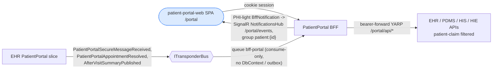

# PatientPortal — Patient-Facing BFF

> **Bounded context:** the **patient's window into their own care** — and deliberately **BFF-only**.
> `src/backend/PatientPortal` contains a single host, `Dialysis.PatientPortal.Bff`: no API, no
> DbContext, no domain. The patient-facing *domain* (secure messages, appointment requests,
> after-visit summaries) lives in the **EHR `PatientPortal` slice**; this BFF is the
> aggregation + event-push edge for the `patient-portal-web` SPA, served at `/portal` via the
> gateway.

Generated from current code. See the root [README](../../README.md) for the system picture.

## Context

## What the host does

- **`AddModuleBff()` / `MapModuleBff()`** (from `Shared/Dialysis.Module.Bff`): OIDC against
  Keycloak, the `/portal`-scoped session cookie (Valkey ticket store), and the bearer-forward
  YARP proxy for `/portal/api/*` calls into the owning module APIs. Patient-facing reads are
  additionally filtered by patient claim on the API side (`his_patient_id` / `sub` must match
  the routed `patientId`).
- **Event push** (`AddModuleBffEvents` + `MapModuleBffEvents`): a consume-only Transponder/
  RabbitMQ subscription (queue `bff-portal`, no DbContext/outbox) and the `[Authorize]` SignalR
  `NotificationsHub` at `/portal/events`.

## The only real logic: event → toast consumers

Three `IConsumer<>`s map upstream integration events to **PHI-light** `BffNotification`s pushed
to the `patient:{id}` SignalR group (never the user group): new secure messages, appointment
request decisions (approved/declined, with the staff note as summary), and after-visit-summary
availability. The notification payload deliberately carries no row identifiers
(`MessageId`/`ThreadId`/`SummaryId` never reach the browser) — the SPA toasts and refetches
through the synchronous API instead.

## Tests

`Dialysis.PatientPortal.Tests` covers the consumers: notification mapping, patient-group
routing, UTC normalization, cancellation propagation, and serialized-payload guards that pin the
PHI-light contract. There are intentionally no host-level WAF tests — `AddModuleBff()` requires
a live OIDC authority and the host exposes no aggregation endpoints of its own.
