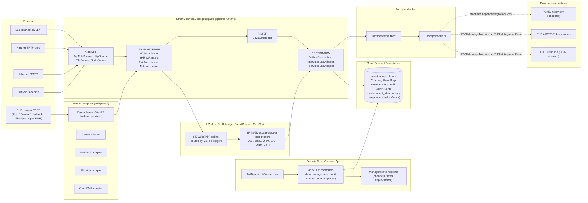
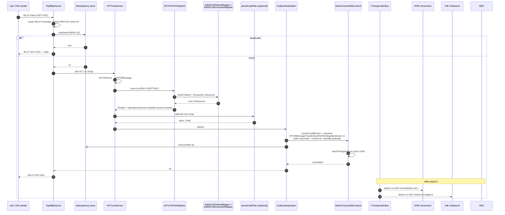
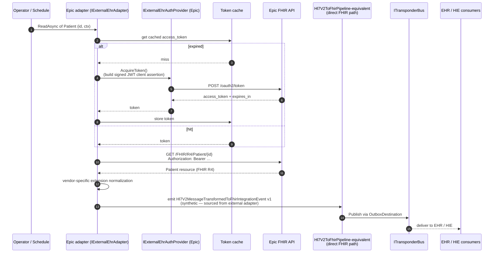
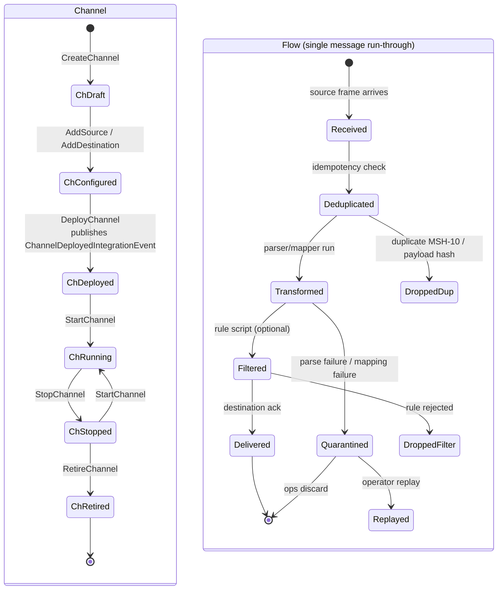
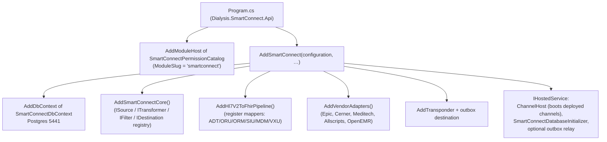
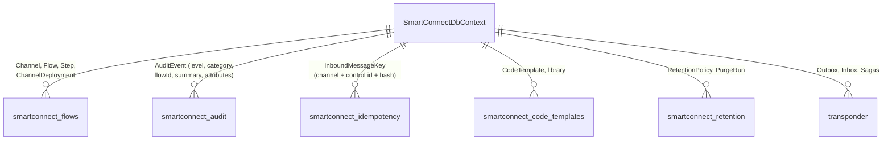

# SmartConnect — Architecture (low-level)

Companion to [README.md](README.md) and [smartconnect_subdomain_structure.md](smartconnect_subdomain_structure.md). SmartConnect is the platform's **Central Interoperability Hub** — it speaks the legacy protocols (HL7 v2 over MLLP, file/SFTP, SMTP, vendor-EHR REST) and normalizes them into platform integration events. Its Large-Scale Structure is a **Pluggable Component Framework** (Evans 2003, p. 334): each pipeline stage (Source, Transformer, Filter, Destination) is a swappable connector implementing a runtime contract declared in `Dialysis.SmartConnect.Core`.

> Mermaid renders inline on GitHub/GitLab/JetBrains/VS Code; paste into <https://mermaid.live> if your viewer does not.

---

## 1. System architecture (component view)

**Invariants**

- Connectors are protocol-pure — **no clinical or billing rules live in a connector** (anti-pattern called out in the README). Downstream modules interpret.
- Every pipeline stage implements a runtime interface from `Dialysis.SmartConnect.Core` (e.g. `ISource`, `ITransformer`, `IFilter`, `IDestination`). New protocols plug in without touching the channel runtime.
- All inbound messages are recorded with an idempotency key (`smartconnect_idempotency`) so replays are safe.
- Vendor adapters use **OAuth2 backend services** (JWT-signed client assertion) for token acquisition — see the recent commit `d36fc07`.

---

## 2. Workflow — Inbound MLLP (HL7 v2 ADT^A01 → FHIR Patient/Encounter)

---

## 3. Workflow — Outbound vendor pull (Epic FHIR Patient)

---

## 4. Activity — Channel + Flow lifecycle

**Notes**

- The flow state per message is recorded as an `AuditEvent` row (see [`AuditEventsTab.tsx`](../../frontend/dialysis-web/src/features/smartconnect/tabs/AuditEventsTab.tsx) — the operator UI filters by category, level, flow, and time window).
- Quarantine + replay are the substrate for dead-letter handling — they keep partner traffic recoverable without requiring partner re-sends.

---

## 5. Composition root

---

## 6. Data layout

---

## 7. Cross-context contracts (DDD context map)

| Counterparty | Role | Vehicle |
|---|---|---|
| External devices / labs / partner EHRs | **Open Host Service** (HL7 v2, FHIR, file, SMTP). Pluggable per protocol. | MLLP, HTTP, SFTP, SMTP |
| PDMS | **Supplier**: `MachineSnapshotIntegrationEvent`, `MachineAlarmIntegrationEvent`. | `Dialysis.SmartConnect.Contracts` |
| EHR / HIS | **Supplier**: `Hl7V2MessageTransformedToFhirIntegrationEvent` (with Bundle payload), ADT/ORU-derived events. ACL-consumed. | `Dialysis.SmartConnect.Contracts` |
| HIE Outbound | **Supplier**: same transformed-FHIR events; HIE maps to partner-specific bundles and dispatches. | `Dialysis.SmartConnect.Contracts` |
| Identity | **Conformist**. | JWT bearer + vendor adapter OAuth2 (separate IdPs per vendor) |

**Anti-pattern guard**: clinical/billing logic must not enter a connector. If a transformation needs domain semantics beyond protocol translation, emit the integration event and let the owning module decide.

---

## 8. Where to look next

- Channel runtime → `Dialysis.SmartConnect.Core/{Channels, Sources, Transformers, Filters, Destinations}/`.
- HL7 v2 parser → `Dialysis.SmartConnect.Core/DataTypes/Hl7V2Parser.cs`, `Hl7V2Message.cs`.
- HL7 v2 → FHIR mappers → `Dialysis.SmartConnect.Core/Fhir/Mappers/` (planned per the cross-cutting FHIR plan).
- Vendor adapters → `Adapters/Dialysis.SmartConnect.Adapters.{Epic,Cerner,Meditech,Allscripts,OpenEMR}/`.
- Frontend operator UI → `src/frontend/dialysis-web/src/features/smartconnect/`.
- Long-form structure rationale → [smartconnect_subdomain_structure.md](smartconnect_subdomain_structure.md).
