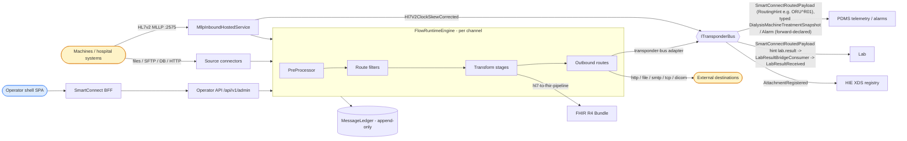
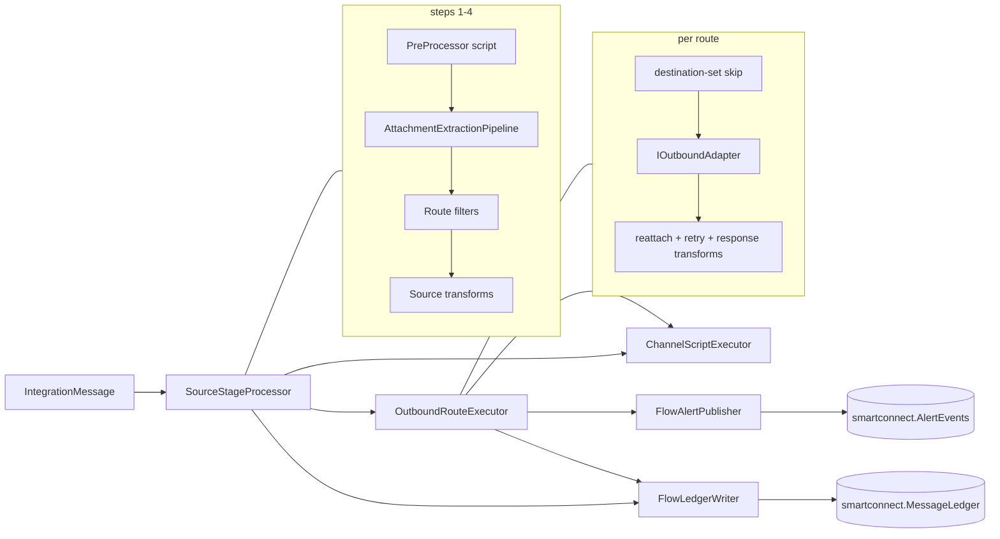
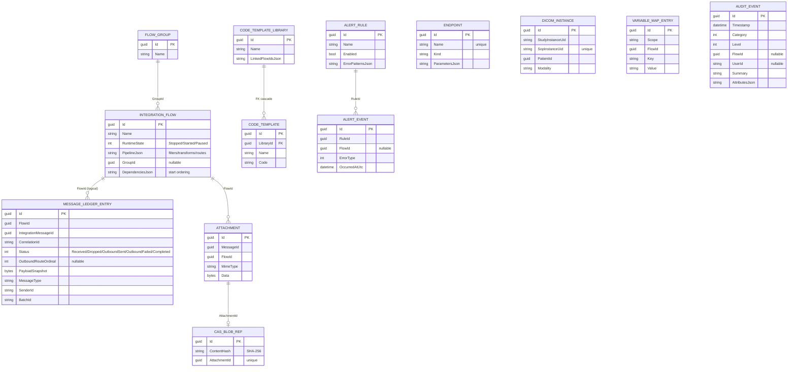
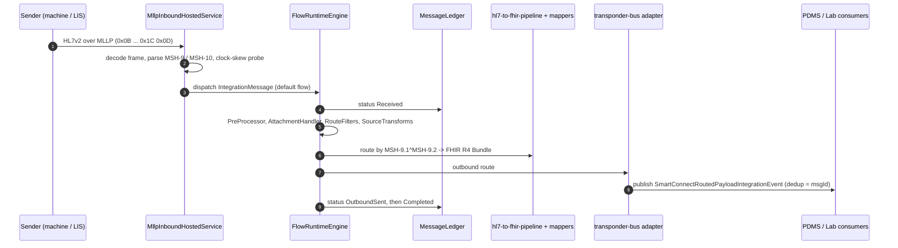

# SmartConnect — Legacy-Protocol Integration Engine

> **Bounded context:** the **translator**. SmartConnect speaks the languages legacy equipment and older hospital systems still use — HL7 v2 over MLLP/TCP, files, SFTP, database polling, vendor EHR adapters, DICOM — and converts them into the platform's modern vocabulary (FHIR R4, integration events). It is a stateless message router with bounded retention: it owns **no patient master record**.
>
> The runtime is a **Mirth-Connect-style flow engine**: a *channel* is an `IntegrationFlow`; a message runs through *source connector → filters → transforms → outbound routes*, each stage logged to an append-only ledger.

Generated from current code. See the root [README](../../../README.md) for the system picture.

> **Note on prior docs:** earlier documentation named an aspirational `ISource`/`TcpMllpSource`/`OutboxDestination` framework and a `Hl7V2MessageTransformedToFhir` event. The real types are `ISourceConnector` / `IRouteFilter` / `ITransformStage` / `IOutboundAdapter` driven by `FlowRuntimeEngine`, and the cross-module event is `SmartConnectRoutedPayloadIntegrationEvent`.

---

## 1. Context

---

## 2. Project layout

| Project | Role |
|---|---|
| `Contracts/Dialysis.SmartConnect.Contracts` | Integration events + `SmartConnectPermissions`. **Only assembly other modules reference.** |
| `Dialysis.SmartConnect.Core.Abstraction` | POCO runtime contracts: `IntegrationFlow`, `IntegrationMessage`, `MessageLedgerEntry`, `IFlowRuntime`, `ISourceConnector`, `IRouteFilter`, `ITransformStage`, `IOutboundAdapter`, `IFlowPluginRegistry`. |
| `Dialysis.SmartConnect.Core` | `FlowRuntimeEngine` + its collaborators (`SourceStageProcessor`, `OutboundRouteExecutor`, `FlowLedgerWriter`, `FlowAlertPublisher`, `AttachmentExtractionPipeline`, `AttachmentReattachmentService`, `ChannelScriptExecutor`), plugin registry, the `Hl7V2ToFhirPipeline`, prescription wire (`Prescription/`), built-in plugins, code templates, time-sync, data pruner. |
| `Persistence/...EntityFrameworkCore.{Abstractions,Postgresql}` | `SmartConnectDbContext`, entities, repositories/stores; the host requires `ConnectionStrings:SmartConnect` and registers `AddSmartConnectPersistenceForPostgresql` (there is no InMemory provider project). |
| `Persistence/...ObjectStorage.{AzureBlob,S3,ContentAddressable,Replication}` | Attachment / DICOM blob backends. |
| `Inbound/...{Mllp,TcpListener,FileReader,Sftp,DatabaseReader,Transponder,AspNetCore,Hosting}` | Source connectors / listeners. |
| `Management/...Management.AspNetCore` | Operator/admin API (`/api/v1/admin/*`). |
| `Adapters/{Epic,Cerner,Meditech,Allscripts,OpenEMR,Common}` | Vendor EHR adapters. |
| `Dicom/{Core,Dimse,Integration,Persistence,Web}` | DICOM DIMSE + DICOMweb (`/dicom-web`). |
| `Api/Dialysis.SmartConnect.Api` | ASP.NET host + `operator-shell/` vanilla-TS SPA. |
| `Dialysis.SmartConnect.Bff` / `Tests` | Per-context BFF, tests. |

---

## 3. Pipeline model

`FlowRuntimeEngine.DispatchCoreAsync` executes a channel's pipeline in this exact order:

1. **PreProcessor script** — drop or rewrite the payload.
2. **Attachment handler** — extract bulky inline content to the attachment store, rewrite payload with `${ATTACH:<id>}` tokens.
3. **Route filters** (`IRouteFilter`) — Mirth source filter; a `Drop` disposition stops the message.
4. **Source transform stages** (`ITransformStage`) — including the destination-set filter that computes per-message routing.
5. **Outbound routes** (`IOutboundAdapter`) — Mirth destinations, run parallel or as a sequential chain. Each route: skip-check → per-route transforms → re-inflate attachments → retry with exponential backoff → response transforms → ledger write.
6. **PostProcessor script**.

The engine itself is **decomposed into focused collaborators**: `SourceStageProcessor` (steps 1–4: preprocessing, attachment extraction, route filters, source transforms), `OutboundRouteExecutor` (step 5: destination-set skip check, adapter invocation, per-route transforms, attachment re-inflation, retry, response transforms, ledger write), `FlowLedgerWriter` (ledger persistence), `FlowAlertPublisher` (alert-rule matching/raising), `AttachmentExtractionPipeline` / `AttachmentReattachmentService` (step 2 and its inverse), and `ChannelScriptExecutor` (pre/post-processor and per-stage scripts).

Registered plugin kinds include transforms (`hl7-to-fhir-pipeline`, `ncpdp-to-fhir`, `javascript`, `mapper-transform`, `xslt`, `verify-hl7`, `destinationSetFilter`, …), outbound adapters (`transponder-bus`, `http`, `file`, `smtp`, `tcp`, `dicom`, `channel-writer`, …), and route filters (`allow-all`, `javascript`, `rule-builder`).

**`Hl7V2ToFhirPipeline`** (the `hl7-to-fhir-pipeline` transform) parses HL7 v2, reads the trigger from **`MSH-9.1^MSH-9.2`** (e.g. `ADT^A01`), and dispatches to every registered `IFhirV2MessageMapper` whose `TriggerEvent` matches, wrapping the results in a FHIR R4 `Bundle`. It is **fail-soft** — non-HL7 or unmatched input passes through unchanged. **13 production mappers**: ADT A01 ×2 (`AdtA01ToPatientMapper`, `AdtA01ToEncounterMapper`), ADT A04/A08/A40 (Patient), ORU R01/R30/R40 (Observation), ORM O01 (ServiceRequest), SIU S12 (Appointment), MDM T02 (DocumentReference), VXU V04 (Immunization), DFT P03 (ChargeItem).

The **MLLP listener** (`MllpInboundHostedService`, dev port **2575**) decodes MLLP frames, shallow-parses MSH (sending app/facility, MSH-9 type, MSH-10 control id), runs a clock-skew probe (rewrites MSH-7 if drifted → `Hl7V2ClockSkewCorrectedIntegrationEvent`), and dispatches to the default flow.

### 3.1 Prescription wire (HD / HF / HDF + UF profiles)

`Dialysis.SmartConnect.Core/Prescription/` answers machine **prescription queries** over HL7 v2 (`Hl7V2RxQueryParser` → `IPrescriptionResolver` → `PrescriptionResponder` → `Hl7V2RxResponseBuilder`). The `PrescriptionDocument` models the full convective-therapy surface:

- **`TherapyModality`** — `Hd` / `Hf` / `Hdf`.
- **`SubstitutionFluidSettings`** (HF/HDF; encoded on wire channel **1.1.6**): `DilutionMode` (`PRE`/`POST`), `FlowRateMlPerMin`, `TargetVolumeMl`, `FluidName`.
- **`UltrafiltrationSettings`** (channels **1.1.5.4–1.1.5.6.n**): `UfMode`, rate/target volume, optional `ProfileShape` (`LINEAR`/`EXP`/`STEP`) and a step list of `UltrafiltrationProfileStep(DurationMinutes, UfRateMlPerHour)`.
- **`GetModalityConsistencyWarnings`** — *warn-don't-refuse*: a prescription whose settings disagree with its modality (e.g. HD with substitution fluid) is still answered, with warnings attached, never rejected.

---

## 4. Domain model (ERD)

Persistence is **EF Core on PostgreSQL** (schema `smartconnect`): the API host requires `ConnectionStrings:SmartConnect` and fails fast without it, registering `AddSmartConnectPersistenceForPostgresql` — there is **no InMemory provider project** (tests boot against a PostgreSQL Testcontainer). **13 persisted entities**, all in the ERD below. The channel pipeline is JSON-projected onto the flow row. **There is no outbox/inbox/saga** on this context (unlike other modules) and no dedicated idempotency table — de-dup rides the bus `DeduplicationId` plus the ledger's `CorrelationId` / `MessageControlId`.

---

## 5. Integration events

**Published:**
- **`SmartConnectRoutedPayloadIntegrationEvent`** — the actively-published cross-module edge event, emitted by the `transponder-bus` outbound adapter. Carries routed bytes + `RoutingHint` (e.g. `ORU^R01`) + format/headers; consumers fan out by hint.
- `Hl7V2ClockSkewCorrectedIntegrationEvent` — MLLP TimeSync rewrote MSH-7.
- `AttachmentRegisteredIntegrationEvent` — attachment persisted (HIE XDS registry consumes, ITI-41).
- `DialysisMachineTreatmentSnapshotIntegrationEvent` / `DialysisMachineAlarmIntegrationEvent` — typed PCD-01/PCD-04 contracts **defined here and consumed by PDMS**, but currently the live machine-telemetry path travels as the generic `SmartConnectRoutedPayloadIntegrationEvent`; the typed events are a forward-declared contract surface.

**Consumed:** `SmartConnectRoutedPayloadIntegrationEvent` is consumed in-process by `LabResultBridgeConsumer` (hosted in the Api host), which bridges payloads with `RoutingHint = "lab.result"` (ORU^R01) into the Lab context's `LabResultReceivedIntegrationEvent`.

---

## 6. Key workflow — HL7 v2 → FHIR → bus

Operators manage channels through the **operator shell** (`/api/v1/admin/*`, mounted by `MapSmartConnectManagementRoutes`): flows CRUD + lifecycle (`start`/`stop`/`pause`, dependency cascade), a message browser with **reprocess-from-ledger**, connector discovery, alert rules, the configuration map, code-template libraries, and the data pruner. `ManagementEndpointExtensions` is split into **seven partials** by concern — `FlowCrud`, `FlowLifecycle`, `FlowImportExport`, `MessageBrowser`, `ChannelAttachmentBlobs`, `ConnectorSchemas`, `ScriptDebug` — alongside sibling endpoint extensions (alerts, attachments, code templates, configuration map, events, groups, ledger, pruner, workbench). The shell SPA is served at `/` and reached in dev via the SmartConnect BFF.

---

## 7. Why no patient eraser

SmartConnect ships **no `IPatientEraser` and no `IModuleDataExtractor`** — it routes and transforms messages and owns no patient master record. Patient identifiers appear only transiently inside `IntegrationMessage.Payload`, ledger `PayloadSnapshot`, attachments, and DICOM index rows. That derived data-at-rest is governed by storage-limitation, not per-patient erasure: the **`DataPrunerJob`** (a persistent Hangfire recurring job, daily at **01:00 UTC**, `SmartConnect:DataPruner:RetentionDays`, with `/api/v1/admin/pruner` controls) bounds retention, and right-to-erasure is delegated to the patient-owning modules (HIS / EHR / PDMS / HIE).

---

## 8. References

- Riech KP, Ulrich H, Ingenerf J, Andersen B. *Mapping of medical device data from ISO/IEEE
  11073-10207 to HL7 FHIR.* MIBE. 2021;17. DOI: 10.3205/mibe000222 — the adopted methodology
  for crossing the device-side (11073/MDC) ↔ clinical-exchange (FHIR) boundary; see
  [docs/interoperability/ieee11073-to-fhir-mapping.md](../../../docs/interoperability/ieee11073-to-fhir-mapping.md)
  for how it maps onto this module's containment model and where the implementation seams are.
